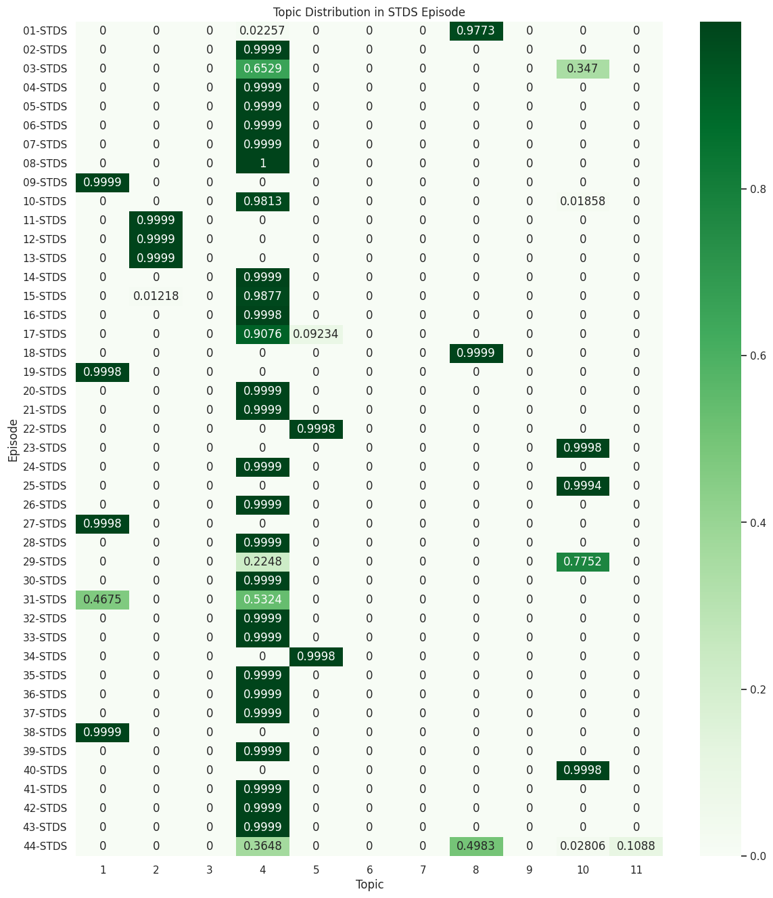

# STDS transcipt analysis
Let's take a look what is in the transcripts (Uses LDA)

Topic 4 is the most popular. Episode 9, 18, 19, 25 & 40 are extreme outliers.

## Heatmap



## Topic keywords
```
opic  1
['go', 'think', 'get', 'yeah', 'day', 'would', 'oh', 'know', 'thing'] 

Topic  2
['think', 'like', 'go', 'thing', 'know', 'say', 'get', 'job', 'yeah'] 

Topic  3
['say', 'think', 'like', 'get', 'thing', 'yeah', 'know', 'really', 'would'] 

Topic  4
['like', 'think', 'get', 'yeah', 'thing', 'say', 'know', 'would', 'people'] 

Topic  5
['go', 'think', 'like', 'get', 'tabitha_lewis', 'thing', 'people', 'right', 'okay'] 

Topic  6
['go', 'think', 'get', 'thing', 'work', 'yeah', 'would', 'oh', 'like'] 

Topic  7
['go', 'get', 'time', 'know', 'yeah', 'think', 'thing', 'people', 'something'] 

Topic  8
['like', 'think', 'question', 'tool', 'would', 'love', 'pet', 'use', 'research'] 

Topic  9
['go', 'thing', 'know', 'get', 'people', 'yeah', 'think', 'say', 'makerspace'] 

Topic  10
['go', 'thing', 'think', 'yeah', 'get', 'work', 'move', 'time', 'would'] 

Topic  11
['really', 'evan_williamson', 'metadata', 'template', 'devin_becker', 'collection', 'olivia_wikle', 'work', 'sheet'] 
```

## Colab Notebook

[STDS\_Transcipt\_Analysis.ipynb](STDS\_Transcipt\_Analysis.ipynb)


## LDA model

<html>
<link rel="stylesheet" type="text/css" href="https://cdn.jsdelivr.net/gh/bmabey/pyLDAvis@3.4.0/pyLDAvis/js/ldavis.v1.0.0.css">


<div id="ldavis_el7061406271473989922839631334" style="background-color:white;"></div>
<script type="text/javascript">

var ldavis_el7061406271473989922839631334_data = {"mdsDat": {"x": [0.038870072201553627, -0.03081597265253305, 0.00882342103985471, 0.10262872323488902, 0.14948993707081887, -0.10247127077134349, 0.03675439227695269, -0.04936165262865227, -0.050042359538755535, -0.05101165405169598, -0.05286363618108852], "y": [0.1168857833077835, 0.1421279191524771, 0.1743468218967193, 0.14376687211767264, 0.07661559941179859, 0.14092949169589442, -0.1439533431293105, -0.1603554771358116, -0.1595628128529392, -0.16732146712822807, -0.16347938733605627], "topics": [1, 2, 3, 4, 5, 6, 7, 8, 9, 10, 11], "cluster": [1, 1, 1, 1, 1, 1, 1, 1, 1, 1, 1], "Freq": [63.4576368702965, 10.07211187059069, 8.666356390822328, 8.198183680041282, 5.113477017135584, 4.181548779545978, 0.30757587253066765, 0.0007815988080636376, 0.0007783093230724714, 0.0007774416050769222, 0.00077216930075264]}, "tinfo": {"Term": ["go", "like", "yeah", "think", "thing", "get", "really", "would", "work", "people", "say", "know", "question", "right", "time", "make", "oh", "see", "something", "okay", "use", "come", "good", "digital_scholarship", "lot", "day", "way", "want", "tool", "answer", "sharon_janzen", "ticket", "stream", "preparation", "rocky", "alison_inni", "lydia_zvyagintseva", "master", "per", "logo", "narrate", "advice", "montage", "vacation", "traffic", "whip", "prison", "milestone", "time_travel", "analyze", "quite_often", "fad", "philosophical", "david_sharron", "sidekick", "spoon", "top_five", "equal", "qualitative", "singer", "smell", "trip", "comfortable", "notebook", "podcast", "fear", "survey", "humanity", "language", "get", "think", "instructor", "go", "episode", "say", "daily", "run", "like", "yeah", "something", "thing", "right", "workshop", "know", "time", "listen", "people", "take", "learn", "really", "story", "okay", "see", "question", "good", "back", "digital_scholarship", "talk", "way", "would", "work", "come", "lot", "make", "oh", "we", "well", "want", "use", "prime_number", "infinite_money", "spock", "alternate_universe", "case_competition", "ganger", "soccer", "giraffe", "world_peace", "glow_stick", "pyramid_scheme", "ashal", "tilly", "explorer", "simulation", "executive", "pluto", "moderator", "gigantic", "elephant", "jog", "fold", "star_trek", "dassa", "flagship", "riddle", "spill", "weightless", "malaria", "cry", "prime", "external", "girlfriend", "competition", "tongue", "budget", "birthday", "pasta", "data_analytic", "pocket", "brainstorming_session", "day", "flour", "sponsorship", "money", "event", "universe", "like", "oh", "go", "daily", "student", "look", "also", "would", "yeah", "get", "see", "think", "know", "lot", "really", "okay", "right", "come", "thing", "good", "want", "could", "workshop", "people", "we", "work", "say", "something", "idea", "well", "make", "time", "omni", "trial", "essential", "hurdle", "usb", "meat_space", "adversity", "wash", "gigabyte", "arrow", "blockchain", "adulty", "kettle", "maintenance", "garage", "persona", "existentialist", "flesh", "aisle", "multicolore", "ventilation", "alma", "adulthood", "overwork", "disorient", "ventilate", "corpus", "neural", "blazer", "february_th", "hurry", "tensorflow", "fantasy", "move", "virus", "board_game", "tire", "quarantine", "catalog", "productivity", "swag", "physical_space", "holiday", "space", "meeting", "book", "physical", "wait", "innovation", "thing", "work", "like", "go", "yeah", "get", "think", "different", "time", "need", "excited", "stuff", "would", "new", "really", "great", "step", "idea", "something", "lot", "come", "know", "people", "student", "use", "we", "project", "even", "say", "talk", "make", "see", "right", "martin_chandler", "nine_year", "saxophone", "classical", "dream_job", "smurf", "business_professional", "adulte", "villain", "bunker", "numb", "subway", "jstor", "peel", "seven_year", "bumbling", "retail", "philanthropist", "saxophonist", "favorite_job", "bartende", "connor", "temp", "uneventful", "astronaut", "distribute", "openly", "schwartz", "commander", "starch", "open_access", "hype", "contemporary", "vet", "least_favorite", "job", "child", "writer", "childhood", "propriety", "potato", "craft", "advocate", "share", "year_old", "ninja", "would", "old", "kid", "audience", "brother", "thing", "know", "say", "think", "make", "like", "teach", "go", "question", "always", "good", "answer", "work", "people", "get", "oh", "talk", "use", "right", "yeah", "really", "okay", "way", "time", "want", "could", "come", "take", "pigeon", "hamster", "pie_chart", "beta_fish", "index", "philosopher", "oscar", "hammy", "pet", "compilation", "fifth", "iron", "blackwater", "pet_love", "soda", "chronicle", "reiteration", "pli", "herbie", "bowl", "bunny", "jerk", "subsequent", "outli", "album", "brew", "graph", "preservation", "devin_becker", "theses", "evan_williamson", "fish", "subjective", "different_type", "love", "dog", "tool", "scale", "fund", "research", "collect", "animal", "datum", "collection", "question", "little", "digital_scholarship", "use", "go", "answer", "think", "like", "could", "would", "people", "way", "want", "also", "interesting", "really", "sort", "work", "thing", "get", "need", "well", "know", "say", "yeah", "right", "come", "main_floor", "circulation", "tabitha_lewis", "moore", "angst", "nohow", "ascas", "tony", "kink", "tanenbaum", "cubed", "lettering", "security", "contingent", "saver", "idiot", "floater", "bolster", "dip", "ppe", "reserve", "chef", "naps", "thingy", "airplane", "moved", "napping", "tuss", "tourist", "por", "impromptu", "coordinate", "decade", "desk", "printer", "law", "nap", "print", "makerspace", "twitter", "maker_space", "reference", "maker", "yeah", "response", "equipment", "help", "happen", "regular", "year", "think", "month", "lucky", "go", "okay", "get", "like", "right", "people", "sure", "thing", "oh", "come", "good", "really", "ask", "see", "try", "say", "time", "make", "work", "lot", "question", "would", "know", "olivia_wikle", "export", "parse", "sustain", "refreshing", "demystify", "trustworthy", "leash", "sadly", "vs", "pester", "daunting", "pdf", "manifesto", "dex", "customization", "curated", "evan", "agent", "caramel", "snapshot", "compound", "cocoa", "snowball", "succinct", "nauseum", "dash", "continuously", "stre", "chrome", "unlimited", "static_web", "evan_williamson", "archival", "devin_becker", "template", "browse", "collection_builder", "builder", "web_archive", "metadata", "doable", "sheet", "digital_collection", "inquiry", "static", "web", "derivative", "cake", "ai", "developer", "interpretive", "infrastructure", "app", "collection", "context", "jazz", "element", "image", "archive", "really", "digital", "work", "tech", "create", "build", "thing", "like", "yeah", "trustworthy", "leash", "sadly", "vs", "pester", "pdf", "dex", "daunting", "manifesto", "customization", "curated", "evan", "agent", "snapshot", "caramel", "compound", "snowball", "nauseum", "cocoa", "succinct", "dash", "continuously", "stre", "chrome", "loudly", "dean", "utopic", "tremendous", "collating", "procedural", "move", "go", "think", "work", "oh", "get", "make", "thing", "would", "yeah", "time", "new", "say", "like", "people", "something", "digital_scholarship", "start", "way", "okay", "really", "different", "search", "library", "see", "know", "day", "job", "right", "catalog", "talk", "good", "lot", "want", "trustworthy", "leash", "sadly", "pester", "vs", "daunting", "manifesto", "dex", "pdf", "customization", "curated", "evan", "caramel", "agent", "snapshot", "snowball", "cocoa", "compound", "nauseum", "dash", "succinct", "continuously", "stre", "chrome", "loudly", "dean", "utopic", "tremendous", "collating", "procedural", "go", "say", "pet", "think", "get", "like", "really", "know", "would", "thing", "digital_scholarship", "yeah", "research", "question", "something", "well", "come", "want", "datum", "use", "love", "right", "answer", "work", "need", "make", "workshop", "oh", "we", "sort", "way", "okay", "time", "trustworthy", "leash", "sadly", "vs", "pester", "daunting", "pdf", "manifesto", "dex", "customization", "curated", "evan", "agent", "caramel", "snapshot", "compound", "cocoa", "snowball", "succinct", "nauseum", "dash", "continuously", "stre", "chrome", "loudly", "dean", "utopic", "tremendous", "collating", "procedural", "friendship", "like", "makerspace", "know", "people", "thing", "go", "get", "yeah", "valve", "tabitha_lewis", "therapeutic", "idea", "say", "think", "want", "make", "booth", "tabba", "raspberry", "really", "friend", "solder", "internationally", "also", "hypnotic", "good", "someone", "would", "friendship_day", "way", "see", "right", "little", "work", "lot", "take", "time", "something", "come", "question", "trustworthy", "leash", "sadly", "vs", "pester", "daunting", "manifesto", "pdf", "dex", "customization", "curated", "evan", "agent", "caramel", "snapshot", "compound", "snowball", "cocoa", "nauseum", "succinct", "dash", "continuously", "stre", "chrome", "loudly", "dean", "utopic", "tremendous", "collating", "procedural", "like", "time", "go", "know", "get", "yeah", "something", "think", "people", "thing", "question", "really", "make", "would", "time_travel", "great", "right", "could", "oh", "experience", "okay", "say", "come", "survey", "see", "lot", "work", "talk", "need", "we", "day", "want"], "Freq": [1851.0, 1730.0, 1308.0, 1594.0, 1192.0, 1361.0, 751.0, 905.0, 697.0, 788.0, 848.0, 867.0, 546.0, 743.0, 657.0, 530.0, 593.0, 547.0, 611.0, 549.0, 473.0, 558.0, 578.0, 358.0, 527.0, 382.0, 453.0, 474.0, 229.0, 364.0, 29.816673871810533, 20.898831129105407, 19.914981015378583, 18.937382595570522, 17.944207212653833, 17.93122102449542, 17.939215741619876, 18.813622245600655, 15.917294567106396, 14.9561588779248, 13.929523912140354, 12.96749960425793, 11.998847246301095, 12.948827206808552, 11.985089337944746, 13.876291375186257, 11.967641998789878, 36.748753192379716, 32.88672317993651, 11.948477297076298, 10.992621048411387, 10.995363886454799, 10.984908598403665, 10.009788807014601, 30.865013943359163, 9.997521116971512, 9.999719379062437, 10.000742003364138, 9.983818331486443, 9.986396751310345, 38.12352900686761, 24.853410541641274, 21.846959721453278, 12.749420219948409, 273.66010235811746, 44.68172889942231, 70.49381170813551, 35.816028591371975, 34.76409032688074, 957.2980576924546, 1092.5077549631012, 25.474421007919197, 1243.2190680797048, 168.74976713362784, 593.9827112691252, 180.79673759695186, 167.32882876562485, 1138.877023047084, 877.8169294159128, 430.6879338901145, 790.3557733097182, 509.3462487694061, 285.5112915889595, 579.2192705027488, 450.4734711974153, 138.75275213566016, 521.5996448817353, 305.87466865038164, 211.1798559948378, 493.6681180848743, 95.26281392753577, 366.5163657728311, 360.712573695055, 357.1632082116741, 375.4615684675784, 197.34828827614734, 248.06383889599124, 262.3971844095895, 301.8865099052921, 537.6438218441937, 431.5145488646944, 353.36655772614785, 333.2854401783047, 333.69269555448574, 362.49438819581616, 271.69316624770704, 272.60180405475353, 297.75234017812176, 291.2528594490023, 17.828100646703405, 14.068739621499764, 8.486747712273258, 8.483900299347928, 6.628331985921592, 6.619484430141954, 6.6190427462552535, 6.607228305679292, 6.606913334383038, 5.681478791132729, 10.004923841656023, 4.760557327978841, 4.746654241537012, 4.746752292946287, 6.354595983565566, 3.8253251862171855, 3.8218451154295523, 3.8154171667341634, 3.8123881324291933, 3.8106922955937113, 3.810619285005882, 19.570290154557515, 10.339304489799972, 2.8911278639441806, 2.8885287473567978, 2.8874685853500583, 2.8860364313813633, 2.8853630444721308, 2.885029669680598, 2.885174785766324, 31.842217487427916, 7.572327510099232, 5.694411319471063, 15.98686413064991, 5.6826276519527825, 10.35573488902793, 15.970461487513193, 6.347348626785286, 7.565850083154239, 15.047360266106972, 5.673650366616258, 121.10733712310996, 5.433920403176472, 6.624059358050378, 32.38967863106079, 31.933452966122893, 12.221411246812208, 194.7767242251875, 96.11600358153181, 190.5783233826703, 50.68960265919283, 49.74792778560023, 63.9658720857446, 58.131923051493466, 100.74628920375534, 121.73261669228933, 124.23991371627434, 72.22361334008961, 128.52020226867126, 88.98692636710872, 67.83245006426502, 79.8098599265528, 66.48734161127446, 75.4352296268151, 65.02675816442971, 88.14875033739321, 63.16430030644278, 56.79922519164725, 51.074075207913616, 50.83752573049405, 67.15796739282179, 51.29413515356302, 57.689534401432375, 60.97097535942702, 53.21011158260844, 42.94896945252905, 44.574515797123695, 45.813002242579294, 46.4290136908574, 5.583373066358364, 6.373472004916138, 5.52631901244226, 4.658899378338167, 4.644781883738086, 4.6381831283553625, 3.7555339198691438, 3.723936213232797, 3.7206529300667586, 3.7189518425756893, 3.716113235568998, 2.832662156296893, 2.8157120252398378, 2.8120017179744847, 2.8063154183419683, 3.5919553946177185, 2.795716135059828, 2.7803907722931136, 6.4077865712627755, 1.9149623165195953, 1.9142803759062823, 1.9142807652899596, 1.9157975445071609, 1.9189898416872964, 1.9111611530628987, 1.9126471709696022, 1.9181123006734766, 1.9182641603075794, 1.9178647824493449, 1.9145380181060208, 5.587903934826108, 4.671126544980066, 4.626195822058611, 84.8708886579399, 7.266472069898452, 4.312961833906367, 3.729727646458154, 6.253038748631709, 7.4149767742386254, 4.615348631168661, 4.141427940540899, 6.9959698252480305, 8.690912841891667, 50.02517805506468, 12.862719718159317, 42.774762610478696, 11.835986608014585, 15.859640782786238, 9.187423756345973, 122.08321717950639, 86.80581194990312, 153.71528510824083, 152.340185478286, 111.9312807095607, 111.7162329306805, 120.4625171698246, 47.086658311876924, 67.50826841547189, 44.64591835475287, 14.901666599893844, 39.781430105820725, 66.76332656154658, 35.46390235891567, 60.43523748379567, 38.50850475275969, 16.473848365041707, 37.127843685538174, 52.139558419456755, 47.38309247107151, 47.917277035060984, 58.50332957902858, 55.80594112931018, 31.33953175973761, 42.82857854973532, 39.44173386255599, 27.800474397254824, 31.40131189313829, 49.73823862745461, 36.30310621341434, 40.049903401923885, 39.05486300803273, 39.429211283497665, 21.28877799013049, 14.844197783665578, 10.22841947989345, 8.389048432461589, 7.463503221669361, 6.5232334045378115, 5.6148547047151425, 5.61177285605168, 14.833688556940357, 4.6973610998175435, 3.7743503718982714, 3.773299842130758, 3.775563466113212, 3.7724558330585416, 3.7704095346591293, 3.7701912268135658, 3.6776812513397257, 2.8531143467910183, 2.8525743479694285, 2.8512974066905437, 2.8504295777521635, 2.8493900984380254, 2.8491631957953927, 2.848043907651324, 2.849075774430915, 2.85042810435838, 2.850263820951539, 2.8500160452303094, 2.848724615579222, 2.8482681090720208, 22.210611721982517, 5.619901078423043, 5.617608477696184, 5.616793199802742, 8.029260404510628, 72.32288937695509, 31.47699150046448, 7.461088329258486, 7.454823458891774, 4.6893826724808205, 10.218746158574639, 5.615743652297751, 7.457335595292349, 41.86773772025478, 6.526970422303593, 10.224624017507596, 125.96829263692251, 27.744122811576403, 25.119039972621618, 22.24393792483636, 7.456069458901209, 110.12653555677949, 85.31537005554704, 81.7816531285138, 115.3305231089945, 60.54937684318639, 114.6412970005041, 25.851169343557498, 113.48253369019268, 58.45733447811406, 39.93866842381893, 55.120439386232974, 43.729258787562685, 59.14905160436081, 60.59436053765393, 77.5880836714546, 51.376860106802624, 41.7614922768015, 45.613713720239346, 54.10302365286887, 65.28235772884716, 48.388797868962186, 43.13267968016797, 39.19082874610268, 42.236683381700395, 38.26441767089712, 36.42694631918323, 38.14672297548485, 33.66723261440807, 6.930898100138565, 5.2304401189602325, 5.218852701315772, 4.372489042398942, 4.369886422499737, 3.5036704348178533, 3.5036566497548276, 3.5012350736833566, 48.899164682158755, 2.6746502231954463, 2.667943636866197, 2.654492785035428, 2.65233465683511, 2.6495457854176943, 2.6481746311487626, 1.8065187244224923, 1.7957274707514344, 1.7959448152451356, 1.792915164726875, 1.7899287074060943, 1.7892916843269515, 1.7892831069544024, 1.788980907739411, 1.7864432308037923, 5.263678050257735, 4.360182044464553, 8.648820837165944, 3.3952015942305134, 5.152834502813211, 0.9427852734241253, 5.079983508071035, 6.945145115942737, 5.2158316281700605, 7.770231989581881, 49.17114581365933, 13.773174787099103, 53.52256454039124, 11.196630100443196, 6.860518307694751, 45.931104600157035, 11.188169135092906, 14.566796182211084, 29.30410317866606, 13.179853421094283, 58.83638407256302, 33.20700129209037, 42.48073150768185, 47.53632311256619, 84.54625936771495, 36.374281879596985, 72.01438478118668, 72.69650155849838, 33.58161436215857, 49.630285214182805, 45.509372346659426, 34.58783573861322, 34.27697215200832, 27.646023544575307, 25.863182350740065, 36.17339001178394, 23.53135990562347, 33.78918922852636, 39.92767656842132, 40.73311635756712, 24.30073796989469, 26.079128732715848, 32.57419215354704, 32.08966618095589, 33.10168095989804, 28.656996785422198, 25.88711567083012, 5.313183573625785, 4.439011895119391, 42.70775270580731, 2.6958256928855073, 2.694993263423697, 2.6943740140617964, 1.8235906716674855, 1.8232065216284585, 1.822911676766421, 1.822926707090739, 1.822552577267924, 1.8225470661490075, 1.8221354857681002, 1.8219770410992482, 1.8212733714157616, 1.8212683613076557, 1.8206488614403498, 1.8203290912904848, 1.8201886830108145, 1.8173717497282207, 7.667874262144589, 3.5635506147865157, 0.9511270016407762, 0.95111441374416, 0.9510967531130863, 0.9508971003050626, 0.9509566579651725, 0.9509506458354453, 0.9510133348131216, 0.95070790609771, 1.5478196669474948, 5.302977482403069, 19.261174237463365, 23.623022451577516, 6.078468568621418, 3.563786590878308, 4.436888110293261, 13.735172293732889, 24.96711020573405, 18.775456280846928, 7.044103778689174, 9.699683523664657, 6.314371512835278, 97.26784200431587, 10.153016141483961, 4.896819040488158, 23.804181948560448, 25.334250927741117, 5.301853715154895, 23.794813046402243, 64.79198057392676, 10.082585043751553, 4.4346295535590805, 66.58044487665232, 33.64578179443542, 49.819188329354525, 54.83807815283436, 36.37053510000871, 36.92564706197962, 22.472018251696174, 40.529930857689465, 29.519697243529784, 27.86909708757841, 28.04621643338467, 30.3867465523527, 21.168239823317208, 26.269006837508403, 20.593277813030365, 29.719552459921033, 27.092834945722547, 24.975881903006016, 26.931423290850194, 24.220533956427808, 24.24424178798536, 24.359622573623106, 23.001781070694005, 1.587922914410122, 0.5513479309074176, 0.5336525493958826, 0.5272288605352519, 0.5248663832144529, 0.52468599220434, 0.3261172066427029, 0.3255946070687679, 0.3250450686126281, 0.32502988554905987, 0.32475338427247613, 0.3241111996468932, 0.3239564945477198, 0.32381892567320464, 0.32360168256705224, 0.32291015298487263, 0.3229293160748131, 0.3229178182208488, 0.32251815723930133, 0.3223026093295668, 0.3219377367266805, 0.32173696650745776, 0.32176033073634674, 0.32159829207006146, 0.32140820895869016, 0.32128453332438184, 0.3212184206640871, 0.32045001760956926, 0.31948891494486126, 0.31929212475201074, 0.6651120097254196, 1.1391836380328064, 2.1775437739197563, 0.9517849070411969, 1.851880769360739, 1.983261587317328, 0.6043133479753974, 3.9649066942939832, 0.8499041919641612, 1.074386229045739, 2.141371083122922, 0.8738583492065506, 1.482904317059522, 0.8608885488222462, 0.5647765767395089, 1.172061825147909, 1.4335172016648736, 0.5313183376327459, 1.2399515672178358, 0.8797110516911467, 0.4329429939309797, 0.5073006105246886, 1.0180534517021578, 0.8062049027764285, 1.7155153368938587, 1.2066179618998782, 0.9547977133008033, 0.9882596376171702, 1.1932425673465639, 1.3178461374331198, 2.247223569702702, 1.2090395868348205, 1.5016565798333714, 0.7651872669132921, 1.0450043476902804, 0.9798403340518129, 1.2767358554005404, 1.2769796688679371, 0.9597049384094122, 0.00010777311047960424, 0.00010778627958742666, 0.00010780483339711423, 0.00010780831004157935, 0.00010772380533991712, 0.00010788600192479479, 0.00010787275087585703, 0.0001077687324828704, 0.0001077633946044997, 0.00010787417899243866, 0.00010778739164542055, 0.0001077352536843174, 0.00010780329992767002, 0.00010789033309803417, 0.00010778903046772733, 0.00010783741084339848, 0.0001078497605400675, 0.00010786598488090472, 0.0001077808363561934, 0.00010781787374032684, 0.00010781836538701886, 0.00010778165576734679, 0.00010784850801159017, 0.00010782870167342527, 0.00010775257837727489, 0.0001078227902072472, 0.000107807396983437, 0.00010778329458965357, 0.0001078726104053736, 0.00010775130243705032, 0.0006320279767189172, 0.00047686540447596686, 0.0004172020649870371, 0.00034611973942886036, 0.00033285080391621505, 0.000367059931924345, 0.00031322604726289574, 0.00035606355130452454, 0.0003340934994597062, 0.0003447894137154505, 0.00030906915106997725, 0.00025827174661378904, 0.00030516070033876806, 0.00032455855033783874, 0.00028202188724824203, 0.0002718723095260868, 0.00024849532873088984, 0.00024373309840133782, 0.0002541254091188758, 0.0002600981438394641, 0.00026968473927574263, 0.00024118056242327166, 0.00016653240534886726, 0.0002107849973347878, 0.0002513955291554677, 0.0002661327792197546, 0.0002385971931740906, 0.00020753060058621822, 0.00024687959040687896, 0.00014982457681352872, 0.00022408855882160084, 0.00023227405483256344, 0.0002248373367335729, 0.00021932335520014938, 0.0001071606037266403, 0.00010712879284461558, 0.00010713389843872582, 0.00010712981862608066, 0.00010705232549903765, 0.00010713736045117043, 0.00010712395535247918, 0.00010714483233661486, 0.00010707206013563269, 0.00010716141968916935, 0.00010710476857643935, 0.00010709525678467233, 0.00010716506820733488, 0.00010711288157529944, 0.0001071501011232309, 0.00010714177830543477, 0.00010713214994759217, 0.00010705387582784282, 0.00010711965406429042, 0.00010715369135835865, 0.00010708719041224246, 0.00010710966435161355, 0.00010711848840353466, 0.00010708215475777759, 0.00010710906986462811, 0.00010711747427867715, 0.00010717517448608732, 0.00010711825527138351, 0.00010710206424348598, 0.00010710966435161355, 0.0005660194515931564, 0.00045634602131871415, 0.00024667827148172286, 0.00042384767920667363, 0.0004017640030566268, 0.0004182847264423092, 0.0003487680294452584, 0.00034918277154215825, 0.0003429252248466508, 0.0003530028283445086, 0.00028473679208552906, 0.00034986162905309843, 0.00025638426233064393, 0.00029532148132535807, 0.00029648257269095665, 0.00027801566210745545, 0.0002683668119487817, 0.0002575797406885375, 0.00021745077345034826, 0.00025225572506588895, 0.00022394061302126377, 0.0002667272168429432, 0.0002415924702911217, 0.0002616346315067435, 0.00023313637084417308, 0.00024430692117984764, 0.00023367066310818376, 0.00024359269752157766, 0.00022749524886952728, 0.00021533857284769387, 0.00022944052685195667, 0.00022839269108538781, 0.00022803564919589818, 0.00010890110684576475, 0.00010881849541939502, 0.00010890496088130081, 0.00010883053491409076, 0.00010879627940790616, 0.00010890193354220904, 0.00010887876275454508, 0.00010884265591406975, 0.00010885547553076222, 0.00010888536468248754, 0.00010884561339149017, 0.0001088189378766469, 0.00010880879629068945, 0.00010883049998325509, 0.00010886137884199117, 0.00010887269643274964, 0.00010884894346449111, 0.00010882856714368111, 0.00010887349984197015, 0.00010887161357684375, 0.00010886720064793689, 0.0001088293938401254, 0.00010888615644809615, 0.00010889080224924083, 0.00010884784896497332, 0.00010883855736268396, 0.00010889741582079517, 0.00010891112035199138, 0.00010890719645478397, 0.00010888713451149503, 0.00016908928872219563, 0.00033998377974481556, 0.00020470000653845415, 0.000269037389512398, 0.00026101987781064105, 0.0002697276693997698, 0.00027949724195727856, 0.0002648768009624552, 0.0002491932050530487, 0.000116075702551865, 0.0001699097441905137, 0.00012128647503274388, 0.00019208339621931111, 0.00021019355577772843, 0.00021619474320824553, 0.00019325938937673418, 0.00019497481942947557, 0.0001203553470333977, 0.00011480061061363393, 0.00012379693090543246, 0.00020060308525833375, 0.0001580734188786633, 0.00012348983064179583, 0.00011963599304713293, 0.0001763909278776433, 0.00011440408741067109, 0.00018291408678564153, 0.00015921413189205533, 0.0001801986800564399, 0.0001258289973399495, 0.00016946655339109, 0.00017128539036103923, 0.00017296319990375936, 0.00016077343275294444, 0.00017150529161522087, 0.0001686068473070859, 0.00016576816965878965, 0.00016945602756594016, 0.00016825419723372998, 0.00016655065530872976, 0.00016148358828581497, 0.00010735205062418041, 0.00010735412069643699, 0.00010735400504994221, 0.0001073368662394156, 0.00010736390438989551, 0.0001073372941314463, 0.000107371583317149, 0.00010734511183449353, 0.00010735605199289985, 0.00010732331247022721, 0.00010733299208184042, 0.0001073104063214096, 0.00010733228663822225, 0.00010730340970847532, 0.0001073418968619386, 0.0001073375485537348, 0.00010734313427943275, 0.00010733151180670721, 0.00010736363840295751, 0.00010734148053455738, 0.00010737154862320057, 0.00010737166426969535, 0.00010732488526255623, 0.0001073267009125243, 0.00010731101924783193, 0.00010733653086458073, 0.00010736738534938843, 0.00010732315056513451, 0.0001073468696612142, 0.00010732249138011426, 0.00047821934984213757, 0.00030332104964915545, 0.0003366214346921885, 0.0002960779940344955, 0.0003120998213266168, 0.0002888782595967807, 0.00025308525313452626, 0.0002823409251518754, 0.00025886829488186875, 0.0002667814756751895, 0.00023537186456323603, 0.00023640618368326279, 0.0002123719046467003, 0.0002217769714813003, 0.00015856769675979426, 0.00019582030076198498, 0.00021025529624061143, 0.00019783662052779935, 0.00020368754676757856, 0.0001824430196892796, 0.00020092465949005277, 0.00020749809877062888, 0.0001975557151919751, 0.00016291674510114515, 0.0001926673956808086, 0.00019181635312571157, 0.0001925924451875407, 0.00018155573352271804, 0.00017892431318045985, 0.00018117994023792556, 0.00017987600287996524, 0.00018147902520272946], "Total": [1851.0, 1730.0, 1308.0, 1594.0, 1192.0, 1361.0, 751.0, 905.0, 697.0, 788.0, 848.0, 867.0, 546.0, 743.0, 657.0, 530.0, 593.0, 547.0, 611.0, 549.0, 473.0, 558.0, 578.0, 358.0, 527.0, 382.0, 453.0, 474.0, 229.0, 364.0, 30.372949327923425, 21.415501337883633, 20.41284220448435, 19.429418751624496, 18.426924233596953, 18.42502850598358, 18.439040744885396, 19.40449520495025, 16.434950637722043, 15.44674701697409, 14.449786019063312, 13.452228797756986, 12.463200756071332, 13.451222952811877, 12.45941747808481, 14.437001045808632, 12.459614042278085, 38.26985456957772, 34.26462838527332, 12.452262368798126, 11.464808847247511, 11.47108594128709, 11.46687768228488, 10.469084127120631, 32.305207602110926, 10.465840614213556, 10.4712339665065, 10.474036018667363, 10.458819975047073, 10.46480136294769, 40.2259020483271, 26.307042127528558, 23.269690352532407, 13.428344392180293, 320.7285220413048, 49.03079241230026, 78.97178684275903, 40.02610345467125, 38.93930607239979, 1361.9521948336258, 1594.3224257648703, 28.057917869679123, 1851.2154978385104, 214.55975078636797, 848.5098712439217, 233.22618934058798, 214.4457486820704, 1730.8234498076235, 1308.0936451717407, 611.7542633842005, 1192.4498652404334, 743.6278216660934, 392.40504121019114, 867.7600031998404, 657.3882289763642, 178.81687903197286, 788.064435761421, 433.231464339281, 288.5941737165247, 751.1104289600619, 118.79810872751726, 549.7851195341964, 547.1394621543016, 546.1453676456929, 578.8612211516962, 274.8333449207867, 358.8792967466196, 384.08741649484045, 453.2850591402542, 905.3880003986875, 697.3821877717083, 558.3898725211744, 527.4433601521874, 530.1462212573055, 593.3581611356268, 410.5997244890869, 412.6162826711872, 474.18757753686947, 473.0345643107865, 18.37082901540545, 14.613671882797375, 8.981356693455346, 8.982116897509007, 7.098299761838298, 7.103354740209283, 7.103338230663939, 7.101320732839044, 7.101496616864571, 6.162406792746219, 10.868733372641342, 5.221448751521392, 5.222945974733798, 5.223493804527095, 7.111343889112054, 4.283032703061839, 4.284720376706109, 4.284785264284049, 4.285071418041877, 4.284865524486042, 4.285413562552848, 22.222679573576013, 11.845025934306747, 3.34465190914713, 3.344312087222328, 3.3451837663130344, 3.34517095696736, 3.345427640788429, 3.3452262943643296, 3.3454441406009474, 37.310853871549504, 8.914071227362214, 7.038682805481947, 22.32755436741296, 7.089031837220671, 13.809918987665249, 22.3670766388795, 8.03911627122371, 10.016054816348362, 24.353349117553172, 7.147937596691692, 382.4845930713272, 6.915279934690688, 9.078511937229154, 86.66961706807209, 88.81538073965368, 22.32891962056847, 1730.8234498076235, 593.3581611356268, 1851.2154978385104, 233.22618934058798, 239.8174853885234, 386.29803218434324, 332.7418522371753, 905.3880003986875, 1308.0936451717407, 1361.9521948336258, 547.1394621543016, 1594.3224257648703, 867.7600031998404, 527.4433601521874, 751.1104289600619, 549.7851195341964, 743.6278216660934, 558.3898725211744, 1192.4498652404334, 578.8612211516962, 474.18757753686947, 396.4318142082683, 392.40504121019114, 788.064435761421, 410.5997244890869, 697.3821877717083, 848.5098712439217, 611.7542633842005, 300.19727238936184, 412.6162826711872, 530.1462212573055, 657.3882289763642, 6.041726418758967, 6.990609243201098, 6.061920649224197, 5.136144869577998, 5.139692513894791, 5.140137752168155, 4.215247193423026, 4.216497513577327, 4.217979170424126, 4.2160968245554775, 4.2180087500789645, 3.285450247990521, 3.2958568201508043, 3.295811442190563, 3.2950970918079303, 4.226383618389592, 3.2953983784648493, 3.2823840070843278, 7.913769929169273, 2.3655355113138006, 2.3649694799254872, 2.365649385287035, 2.3676024733374947, 2.3719412664277844, 2.362269125968992, 2.36444673416233, 2.3715931383730915, 2.371864903593568, 2.3717520727774293, 2.3705341699111875, 6.988518872850694, 6.119563077101826, 6.077143119525619, 144.37795677000224, 10.7498548716201, 6.152895174438359, 5.1997472444412765, 9.97375737606528, 12.590444781292522, 7.062449239132023, 6.168382744584187, 11.907407161728987, 16.220499301171657, 169.10683505181325, 28.909411333091494, 164.42178819588457, 26.24648755443708, 44.70866436033003, 19.560947731399594, 1192.4498652404334, 697.3821877717083, 1730.8234498076235, 1851.2154978385104, 1308.0936451717407, 1361.9521948336258, 1594.3224257648703, 341.242044506132, 657.3882289763642, 320.60196222677655, 47.481712478246834, 306.08891275640445, 905.3880003986875, 263.4178047798243, 751.1104289600619, 317.18734452209094, 60.15413454015385, 300.19727238936184, 611.7542633842005, 527.4433601521874, 558.3898725211744, 867.7600031998404, 788.064435761421, 239.8174853885234, 473.0345643107865, 410.5997244890869, 185.48495879195704, 260.0100161217203, 848.5098712439217, 384.08741649484045, 530.1462212573055, 547.1394621543016, 743.6278216660934, 21.859384319795197, 15.368079805046495, 10.72805404314651, 8.875004375619014, 7.945685613037558, 7.02747462213393, 6.097291250835357, 6.098784959297061, 16.299302717235044, 5.164628747438573, 4.23812600406409, 4.2387687429920256, 4.24208463067436, 4.239408183297089, 4.241571754698487, 4.242262098010151, 4.230988721209754, 3.311281295028554, 3.3111249970735583, 3.3106989935979927, 3.3121716940069286, 3.3114251535946373, 3.3115045515246138, 3.3107072922430945, 3.3119193734373344, 3.3138828360879176, 3.3144865940247414, 3.3142917269100196, 3.3138007802124076, 3.3143359780756145, 27.411035600190324, 7.077257829194463, 7.075779348316252, 7.0773866836324295, 10.881886240269209, 165.26340288139664, 64.81220809617888, 10.930424149148953, 10.929901755915711, 6.153837909935448, 17.68626001588566, 8.07828185498157, 11.802618439290987, 141.61514141759028, 10.001913453360725, 19.609474114819456, 905.3880003986875, 93.02408747379714, 81.10451404863971, 68.79320615652574, 12.862253366685483, 1192.4498652404334, 867.7600031998404, 848.5098712439217, 1594.3224257648703, 530.1462212573055, 1730.8234498076235, 117.90994904745614, 1851.2154978385104, 546.1453676456929, 269.76877200468766, 578.8612211516962, 364.7900833279399, 697.3821877717083, 788.064435761421, 1361.9521948336258, 593.3581611356268, 384.08741649484045, 473.0345643107865, 743.6278216660934, 1308.0936451717407, 751.1104289600619, 549.7851195341964, 453.2850591402542, 657.3882289763642, 474.18757753686947, 396.4318142082683, 558.3898725211744, 433.231464339281, 7.466429137173508, 5.7338188990704335, 5.734056640598651, 4.8681959909035655, 4.86889165717571, 3.999206332179186, 4.000421689118334, 3.9978451470376704, 56.65998950831686, 3.134961439483925, 3.1343482763084505, 3.1304698010802507, 3.132246992439927, 3.1299482796881564, 3.131259048144903, 2.2670010829208334, 2.2630986589784294, 2.2643650474616526, 2.2635342560136626, 2.261603493795571, 2.2630456597270876, 2.2630586011902523, 2.264920993178819, 2.265076082574852, 6.726335156343785, 5.844949672007583, 12.002340187632491, 4.92099172250861, 7.536112245734347, 1.3982522365191692, 7.796173499768924, 11.312011516210717, 8.713762014914714, 15.152608163722542, 191.33193664010315, 34.67809531978026, 229.5155257141826, 27.220053540360304, 14.122906284669352, 194.71227966940324, 30.389380552937542, 45.71480427365056, 138.47196400856413, 42.19863732811712, 546.1453676456929, 226.13353894752882, 358.8792967466196, 473.0345643107865, 1851.2154978385104, 364.7900833279399, 1594.3224257648703, 1730.8234498076235, 396.4318142082683, 905.3880003986875, 788.064435761421, 453.2850591402542, 474.18757753686947, 332.7418522371753, 305.7270020539872, 751.1104289600619, 260.3072963342766, 697.3821877717083, 1192.4498652404334, 1361.9521948336258, 320.60196222677655, 412.6162826711872, 867.7600031998404, 848.5098712439217, 1308.0936451717407, 743.6278216660934, 558.3898725211744, 5.797131378439847, 4.9194225777943075, 49.443236735075416, 3.163542466974014, 3.1634632785358123, 3.163519126724145, 2.285484633968069, 2.2854152640969163, 2.285574486344497, 2.2856525284226317, 2.285386364392747, 2.2859005382163873, 2.2858152043438866, 2.285719719547295, 2.285374276347999, 2.2858327625785924, 2.2856088388743436, 2.2857926494787018, 2.2857850719066035, 2.2862058439998405, 10.444630216878938, 4.980442720042646, 1.4074796859298937, 1.4075354687566222, 1.4075636360175041, 1.407349895901018, 1.407499481334007, 1.407493793078579, 1.4076188624953068, 1.4071848849522453, 2.3136091559578897, 8.579851751402288, 34.210558452289426, 43.79658904234634, 10.50247463774604, 5.894974153786629, 7.892710148243122, 28.11684938629285, 59.22841790732682, 58.10019140675264, 16.250048601200426, 26.68286199250378, 15.313890179869004, 1308.0936451717407, 35.88911385732467, 11.535420933306055, 196.9835161630133, 230.1768598769063, 15.365321126022213, 244.59815257874922, 1594.3224257648703, 52.84360806300068, 11.669216656491674, 1851.2154978385104, 549.7851195341964, 1361.9521948336258, 1730.8234498076235, 743.6278216660934, 788.064435761421, 282.4717338717384, 1192.4498652404334, 593.3581611356268, 558.3898725211744, 578.8612211516962, 751.1104289600619, 302.9087002987467, 547.1394621543016, 285.22262942218237, 848.5098712439217, 657.3882289763642, 530.1462212573055, 697.3821877717083, 527.4433601521874, 546.1453676456929, 905.3880003986875, 867.7600031998404, 3.687646028968049, 1.2855873346862459, 1.3182432241051074, 1.3306590483384482, 1.3350660238360785, 1.3353400348984235, 0.8380162717086963, 0.8391081013252364, 0.840148329260842, 0.8402560925420611, 0.8408342648734416, 0.8419246880826007, 0.8421967157303677, 0.8423378895622029, 0.8427107389386176, 0.8439424998234352, 0.84422242062512, 0.8441959642389576, 0.8449474181262382, 0.8451754996660921, 0.8457011994142738, 0.8461784857681964, 0.8463126643007305, 0.8463855479305615, 0.8468178280167904, 0.8469234145558555, 0.8472068830439896, 0.8485828066832526, 0.8504646342985324, 0.8508409937610736, 1.9411681283799405, 3.6592634995462956, 7.796173499768924, 3.2601393824057707, 7.536112245734347, 9.159576394464004, 2.0547045070259995, 31.5621271423426, 3.453094114590239, 4.906017257779587, 15.694463244295273, 4.27559040076345, 10.429659367076118, 4.301025582974508, 2.250653593449759, 8.442103787013364, 13.910854309949096, 2.19144545614437, 12.504856279277849, 6.208526027990622, 1.5069007033354016, 2.236325231372877, 10.615106464229262, 6.537138322949862, 42.19863732811712, 18.80811739762097, 10.91980686247995, 13.577792833976014, 26.045204065166452, 44.54091787730108, 751.1104289600619, 86.01053949286009, 697.3821877717083, 10.365243058838269, 120.88169404619147, 78.86229254843367, 1192.4498652404334, 1730.8234498076235, 1308.0936451717407, 0.8380162717086963, 0.8391081013252364, 0.840148329260842, 0.8402560925420611, 0.8408342648734416, 0.8421967157303677, 0.8427107389386176, 0.8419246880826007, 0.8423378895622029, 0.8439424998234352, 0.84422242062512, 0.8441959642389576, 0.8449474181262382, 0.8457011994142738, 0.8451754996660921, 0.8461784857681964, 0.8463855479305615, 0.8469234145558555, 0.8463126643007305, 0.8468178280167904, 0.8472068830439896, 0.8485828066832526, 0.8504646342985324, 0.8508409937610736, 0.8511772490695765, 0.8524896429266351, 0.8534669402153288, 0.8538881547284717, 0.8577887942544405, 0.858840679376049, 144.37795677000224, 1851.2154978385104, 1594.3224257648703, 697.3821877717083, 593.3581611356268, 1361.9521948336258, 530.1462212573055, 1192.4498652404334, 905.3880003986875, 1308.0936451717407, 657.3882289763642, 263.4178047798243, 848.5098712439217, 1730.8234498076235, 788.064435761421, 611.7542633842005, 358.8792967466196, 310.7566938086539, 453.2850591402542, 549.7851195341964, 751.1104289600619, 341.242044506132, 20.584057309318418, 127.68978309795104, 547.1394621543016, 867.7600031998404, 382.4845930713272, 165.26340288139664, 743.6278216660934, 12.590444781292522, 384.08741649484045, 578.8612211516962, 527.4433601521874, 474.18757753686947, 0.8380162717086963, 0.8391081013252364, 0.840148329260842, 0.8408342648734416, 0.8402560925420611, 0.8419246880826007, 0.8423378895622029, 0.8427107389386176, 0.8421967157303677, 0.8439424998234352, 0.84422242062512, 0.8441959642389576, 0.8451754996660921, 0.8449474181262382, 0.8457011994142738, 0.8463855479305615, 0.8463126643007305, 0.8461784857681964, 0.8469234145558555, 0.8472068830439896, 0.8468178280167904, 0.8485828066832526, 0.8504646342985324, 0.8508409937610736, 0.8511772490695765, 0.8524896429266351, 0.8534669402153288, 0.8538881547284717, 0.8577887942544405, 0.858840679376049, 1851.2154978385104, 848.5098712439217, 56.65998950831686, 1594.3224257648703, 1361.9521948336258, 1730.8234498076235, 751.1104289600619, 867.7600031998404, 905.3880003986875, 1192.4498652404334, 358.8792967466196, 1308.0936451717407, 194.71227966940324, 546.1453676456929, 611.7542633842005, 412.6162826711872, 558.3898725211744, 474.18757753686947, 138.47196400856413, 473.0345643107865, 191.33193664010315, 743.6278216660934, 364.7900833279399, 697.3821877717083, 320.60196222677655, 530.1462212573055, 392.40504121019114, 593.3581611356268, 410.5997244890869, 260.3072963342766, 453.2850591402542, 549.7851195341964, 657.3882289763642, 0.8380162717086963, 0.8391081013252364, 0.840148329260842, 0.8402560925420611, 0.8408342648734416, 0.8419246880826007, 0.8421967157303677, 0.8423378895622029, 0.8427107389386176, 0.8439424998234352, 0.84422242062512, 0.8441959642389576, 0.8449474181262382, 0.8451754996660921, 0.8457011994142738, 0.8461784857681964, 0.8463126643007305, 0.8463855479305615, 0.8468178280167904, 0.8469234145558555, 0.8472068830439896, 0.8485828066832526, 0.8504646342985324, 0.8508409937610736, 0.8511772490695765, 0.8524896429266351, 0.8534669402153288, 0.8538881547284717, 0.8577887942544405, 0.858840679376049, 9.417649648265527, 1730.8234498076235, 59.22841790732682, 867.7600031998404, 788.064435761421, 1192.4498652404334, 1851.2154978385104, 1361.9521948336258, 1308.0936451717407, 1.502740251368924, 49.443236735075416, 2.4972242599038146, 300.19727238936184, 848.5098712439217, 1594.3224257648703, 474.18757753686947, 530.1462212573055, 2.4973995562935016, 1.504398204005102, 3.489529919868858, 751.1104289600619, 70.92356457762678, 3.4896832445398593, 2.498278754296008, 332.7418522371753, 1.5060117911075661, 578.8612211516962, 113.90816048975607, 905.3880003986875, 5.476407774075091, 453.2850591402542, 547.1394621543016, 743.6278216660934, 226.13353894752882, 697.3821877717083, 527.4433601521874, 433.231464339281, 657.3882289763642, 611.7542633842005, 558.3898725211744, 546.1453676456929, 0.8380162717086963, 0.8391081013252364, 0.840148329260842, 0.8402560925420611, 0.8408342648734416, 0.8419246880826007, 0.8423378895622029, 0.8421967157303677, 0.8427107389386176, 0.8439424998234352, 0.84422242062512, 0.8441959642389576, 0.8449474181262382, 0.8451754996660921, 0.8457011994142738, 0.8461784857681964, 0.8463855479305615, 0.8463126643007305, 0.8469234145558555, 0.8468178280167904, 0.8472068830439896, 0.8485828066832526, 0.8504646342985324, 0.8508409937610736, 0.8511772490695765, 0.8524896429266351, 0.8534669402153288, 0.8538881547284717, 0.8577887942544405, 0.858840679376049, 1730.8234498076235, 657.3882289763642, 1851.2154978385104, 867.7600031998404, 1361.9521948336258, 1308.0936451717407, 611.7542633842005, 1594.3224257648703, 788.064435761421, 1192.4498652404334, 546.1453676456929, 751.1104289600619, 530.1462212573055, 905.3880003986875, 34.26462838527332, 317.18734452209094, 743.6278216660934, 396.4318142082683, 593.3581611356268, 175.88607793471863, 549.7851195341964, 848.5098712439217, 558.3898725211744, 78.97178684275903, 547.1394621543016, 527.4433601521874, 697.3821877717083, 384.08741649484045, 320.60196222677655, 410.5997244890869, 382.4845930713272, 474.18757753686947], "Category": ["Default", "Default", "Default", "Default", "Default", "Default", "Default", "Default", "Default", "Default", "Default", "Default", "Default", "Default", "Default", "Default", "Default", "Default", "Default", "Default", "Default", "Default", "Default", "Default", "Default", "Default", "Default", "Default", "Default", "Default", "Topic1", "Topic1", "Topic1", "Topic1", "Topic1", "Topic1", "Topic1", "Topic1", "Topic1", "Topic1", "Topic1", "Topic1", "Topic1", "Topic1", "Topic1", "Topic1", "Topic1", "Topic1", "Topic1", "Topic1", "Topic1", "Topic1", "Topic1", "Topic1", "Topic1", "Topic1", "Topic1", "Topic1", "Topic1", "Topic1", "Topic1", "Topic1", "Topic1", "Topic1", "Topic1", "Topic1", "Topic1", "Topic1", "Topic1", "Topic1", "Topic1", "Topic1", "Topic1", "Topic1", "Topic1", "Topic1", "Topic1", "Topic1", "Topic1", "Topic1", "Topic1", "Topic1", "Topic1", "Topic1", "Topic1", "Topic1", "Topic1", "Topic1", "Topic1", "Topic1", "Topic1", "Topic1", "Topic1", "Topic1", "Topic1", "Topic1", "Topic1", "Topic1", "Topic1", "Topic1", "Topic1", "Topic1", "Topic1", "Topic1", "Topic1", "Topic1", "Topic1", "Topic1", "Topic1", "Topic2", "Topic2", "Topic2", "Topic2", "Topic2", "Topic2", "Topic2", "Topic2", "Topic2", "Topic2", "Topic2", "Topic2", "Topic2", "Topic2", "Topic2", "Topic2", "Topic2", "Topic2", "Topic2", "Topic2", "Topic2", "Topic2", "Topic2", "Topic2", "Topic2", "Topic2", "Topic2", "Topic2", "Topic2", "Topic2", "Topic2", "Topic2", "Topic2", "Topic2", "Topic2", "Topic2", "Topic2", "Topic2", "Topic2", "Topic2", "Topic2", "Topic2", "Topic2", "Topic2", "Topic2", "Topic2", "Topic2", "Topic2", "Topic2", "Topic2", "Topic2", "Topic2", "Topic2", "Topic2", "Topic2", "Topic2", "Topic2", "Topic2", "Topic2", "Topic2", "Topic2", "Topic2", "Topic2", "Topic2", "Topic2", "Topic2", "Topic2", "Topic2", "Topic2", "Topic2", "Topic2", "Topic2", "Topic2", "Topic2", "Topic2", "Topic2", "Topic2", "Topic2", "Topic2", "Topic3", "Topic3", "Topic3", "Topic3", "Topic3", "Topic3", "Topic3", "Topic3", "Topic3", "Topic3", "Topic3", "Topic3", "Topic3", "Topic3", "Topic3", "Topic3", "Topic3", "Topic3", "Topic3", "Topic3", "Topic3", "Topic3", "Topic3", "Topic3", "Topic3", "Topic3", "Topic3", "Topic3", "Topic3", "Topic3", "Topic3", "Topic3", "Topic3", "Topic3", "Topic3", "Topic3", "Topic3", "Topic3", "Topic3", "Topic3", "Topic3", "Topic3", "Topic3", "Topic3", "Topic3", "Topic3", "Topic3", "Topic3", "Topic3", "Topic3", "Topic3", "Topic3", "Topic3", "Topic3", "Topic3", "Topic3", "Topic3", "Topic3", "Topic3", "Topic3", "Topic3", "Topic3", "Topic3", "Topic3", "Topic3", "Topic3", "Topic3", "Topic3", "Topic3", "Topic3", "Topic3", "Topic3", "Topic3", "Topic3", "Topic3", "Topic3", "Topic3", "Topic3", "Topic3", "Topic3", "Topic3", "Topic3", "Topic4", "Topic4", "Topic4", "Topic4", "Topic4", "Topic4", "Topic4", "Topic4", "Topic4", "Topic4", "Topic4", "Topic4", "Topic4", "Topic4", "Topic4", "Topic4", "Topic4", "Topic4", "Topic4", "Topic4", "Topic4", "Topic4", "Topic4", "Topic4", "Topic4", "Topic4", "Topic4", "Topic4", "Topic4", "Topic4", "Topic4", "Topic4", "Topic4", "Topic4", "Topic4", "Topic4", "Topic4", "Topic4", "Topic4", "Topic4", "Topic4", "Topic4", "Topic4", "Topic4", "Topic4", "Topic4", "Topic4", "Topic4", "Topic4", "Topic4", "Topic4", "Topic4", "Topic4", "Topic4", "Topic4", "Topic4", "Topic4", "Topic4", "Topic4", "Topic4", "Topic4", "Topic4", "Topic4", "Topic4", "Topic4", "Topic4", "Topic4", "Topic4", "Topic4", "Topic4", "Topic4", "Topic4", "Topic4", "Topic4", "Topic4", "Topic4", "Topic4", "Topic4", "Topic4", "Topic5", "Topic5", "Topic5", "Topic5", "Topic5", "Topic5", "Topic5", "Topic5", "Topic5", "Topic5", "Topic5", "Topic5", "Topic5", "Topic5", "Topic5", "Topic5", "Topic5", "Topic5", "Topic5", "Topic5", "Topic5", "Topic5", "Topic5", "Topic5", "Topic5", "Topic5", "Topic5", "Topic5", "Topic5", "Topic5", "Topic5", "Topic5", "Topic5", "Topic5", "Topic5", "Topic5", "Topic5", "Topic5", "Topic5", "Topic5", "Topic5", "Topic5", "Topic5", "Topic5", "Topic5", "Topic5", "Topic5", "Topic5", "Topic5", "Topic5", "Topic5", "Topic5", "Topic5", "Topic5", "Topic5", "Topic5", "Topic5", "Topic5", "Topic5", "Topic5", "Topic5", "Topic5", "Topic5", "Topic5", "Topic5", "Topic5", "Topic5", "Topic5", "Topic5", "Topic5", "Topic5", "Topic6", "Topic6", "Topic6", "Topic6", "Topic6", "Topic6", "Topic6", "Topic6", "Topic6", "Topic6", "Topic6", "Topic6", "Topic6", "Topic6", "Topic6", "Topic6", "Topic6", "Topic6", "Topic6", "Topic6", "Topic6", "Topic6", "Topic6", "Topic6", "Topic6", "Topic6", "Topic6", "Topic6", "Topic6", "Topic6", "Topic6", "Topic6", "Topic6", "Topic6", "Topic6", "Topic6", "Topic6", "Topic6", "Topic6", "Topic6", "Topic6", "Topic6", "Topic6", "Topic6", "Topic6", "Topic6", "Topic6", "Topic6", "Topic6", "Topic6", "Topic6", "Topic6", "Topic6", "Topic6", "Topic6", "Topic6", "Topic6", "Topic6", "Topic6", "Topic6", "Topic6", "Topic6", "Topic6", "Topic6", "Topic6", "Topic6", "Topic6", "Topic6", "Topic6", "Topic6", "Topic6", "Topic6", "Topic6", "Topic6", "Topic6", "Topic6", "Topic7", "Topic7", "Topic7", "Topic7", "Topic7", "Topic7", "Topic7", "Topic7", "Topic7", "Topic7", "Topic7", "Topic7", "Topic7", "Topic7", "Topic7", "Topic7", "Topic7", "Topic7", "Topic7", "Topic7", "Topic7", "Topic7", "Topic7", "Topic7", "Topic7", "Topic7", "Topic7", "Topic7", "Topic7", "Topic7", "Topic7", "Topic7", "Topic7", "Topic7", "Topic7", "Topic7", "Topic7", "Topic7", "Topic7", "Topic7", "Topic7", "Topic7", "Topic7", "Topic7", "Topic7", "Topic7", "Topic7", "Topic7", "Topic7", "Topic7", "Topic7", "Topic7", "Topic7", "Topic7", "Topic7", "Topic7", "Topic7", "Topic7", "Topic7", "Topic7", "Topic7", "Topic7", "Topic7", "Topic7", "Topic7", "Topic7", "Topic7", "Topic7", "Topic7", "Topic8", "Topic8", "Topic8", "Topic8", "Topic8", "Topic8", "Topic8", "Topic8", "Topic8", "Topic8", "Topic8", "Topic8", "Topic8", "Topic8", "Topic8", "Topic8", "Topic8", "Topic8", "Topic8", "Topic8", "Topic8", "Topic8", "Topic8", "Topic8", "Topic8", "Topic8", "Topic8", "Topic8", "Topic8", "Topic8", "Topic8", "Topic8", "Topic8", "Topic8", "Topic8", "Topic8", "Topic8", "Topic8", "Topic8", "Topic8", "Topic8", "Topic8", "Topic8", "Topic8", "Topic8", "Topic8", "Topic8", "Topic8", "Topic8", "Topic8", "Topic8", "Topic8", "Topic8", "Topic8", "Topic8", "Topic8", "Topic8", "Topic8", "Topic8", "Topic8", "Topic8", "Topic8", "Topic8", "Topic8", "Topic9", "Topic9", "Topic9", "Topic9", "Topic9", "Topic9", "Topic9", "Topic9", "Topic9", "Topic9", "Topic9", "Topic9", "Topic9", "Topic9", "Topic9", "Topic9", "Topic9", "Topic9", "Topic9", "Topic9", "Topic9", "Topic9", "Topic9", "Topic9", "Topic9", "Topic9", "Topic9", "Topic9", "Topic9", "Topic9", "Topic9", "Topic9", "Topic9", "Topic9", "Topic9", "Topic9", "Topic9", "Topic9", "Topic9", "Topic9", "Topic9", "Topic9", "Topic9", "Topic9", "Topic9", "Topic9", "Topic9", "Topic9", "Topic9", "Topic9", "Topic9", "Topic9", "Topic9", "Topic9", "Topic9", "Topic9", "Topic9", "Topic9", "Topic9", "Topic9", "Topic9", "Topic9", "Topic9", "Topic10", "Topic10", "Topic10", "Topic10", "Topic10", "Topic10", "Topic10", "Topic10", "Topic10", "Topic10", "Topic10", "Topic10", "Topic10", "Topic10", "Topic10", "Topic10", "Topic10", "Topic10", "Topic10", "Topic10", "Topic10", "Topic10", "Topic10", "Topic10", "Topic10", "Topic10", "Topic10", "Topic10", "Topic10", "Topic10", "Topic10", "Topic10", "Topic10", "Topic10", "Topic10", "Topic10", "Topic10", "Topic10", "Topic10", "Topic10", "Topic10", "Topic10", "Topic10", "Topic10", "Topic10", "Topic10", "Topic10", "Topic10", "Topic10", "Topic10", "Topic10", "Topic10", "Topic10", "Topic10", "Topic10", "Topic10", "Topic10", "Topic10", "Topic10", "Topic10", "Topic10", "Topic10", "Topic10", "Topic10", "Topic10", "Topic10", "Topic10", "Topic10", "Topic10", "Topic10", "Topic10", "Topic11", "Topic11", "Topic11", "Topic11", "Topic11", "Topic11", "Topic11", "Topic11", "Topic11", "Topic11", "Topic11", "Topic11", "Topic11", "Topic11", "Topic11", "Topic11", "Topic11", "Topic11", "Topic11", "Topic11", "Topic11", "Topic11", "Topic11", "Topic11", "Topic11", "Topic11", "Topic11", "Topic11", "Topic11", "Topic11", "Topic11", "Topic11", "Topic11", "Topic11", "Topic11", "Topic11", "Topic11", "Topic11", "Topic11", "Topic11", "Topic11", "Topic11", "Topic11", "Topic11", "Topic11", "Topic11", "Topic11", "Topic11", "Topic11", "Topic11", "Topic11", "Topic11", "Topic11", "Topic11", "Topic11", "Topic11", "Topic11", "Topic11", "Topic11", "Topic11", "Topic11", "Topic11"], "logprob": [30.0, 29.0, 28.0, 27.0, 26.0, 25.0, 24.0, 23.0, 22.0, 21.0, 20.0, 19.0, 18.0, 17.0, 16.0, 15.0, 14.0, 13.0, 12.0, 11.0, 10.0, 9.0, 8.0, 7.0, 6.0, 5.0, 4.0, 3.0, 2.0, 1.0, -7.6918, -8.0472, -8.0954, -8.1458, -8.1996, -8.2004, -8.1999, -8.1523, -8.3195, -8.3818, -8.4529, -8.5245, -8.6021, -8.5259, -8.6032, -8.4567, -8.6047, -7.4828, -7.5938, -8.6063, -8.6897, -8.6894, -8.6904, -8.7833, -7.6573, -8.7846, -8.7844, -8.7843, -8.7859, -8.7857, -7.4461, -7.8739, -8.0028, -8.5414, -5.475, -7.2873, -6.8314, -7.5085, -7.5383, -4.2228, -4.0907, -7.8492, -3.9615, -5.9585, -4.7001, -5.8895, -5.9669, -4.0491, -4.3095, -5.0215, -4.4144, -4.8538, -5.4326, -4.7252, -4.9766, -6.1542, -4.83, -5.3637, -5.7342, -4.885, -6.5303, -5.1829, -5.1988, -5.2087, -5.1588, -5.8019, -5.5732, -5.5171, -5.3769, -4.7997, -5.0196, -5.2194, -5.2779, -5.2767, -5.1939, -5.4822, -5.4789, -5.3906, -5.4127, -6.3655, -6.6024, -7.1078, -7.1081, -7.355, -7.3563, -7.3564, -7.3581, -7.3582, -7.5091, -6.9432, -7.6859, -7.6889, -7.6888, -7.3971, -7.9047, -7.9056, -7.9073, -7.9081, -7.9085, -7.9085, -6.2723, -6.9104, -8.1847, -8.1856, -8.1859, -8.1864, -8.1867, -8.1868, -8.1867, -5.7855, -7.2218, -7.5068, -6.4745, -7.5089, -6.9088, -6.4756, -7.3983, -7.2227, -6.5351, -7.5105, -4.4496, -7.5536, -7.3556, -5.7685, -5.7827, -6.7431, -3.9745, -4.6808, -3.9962, -5.3206, -5.3393, -5.088, -5.1836, -4.6337, -4.4445, -4.4241, -4.9665, -4.3902, -4.7578, -5.0293, -4.8667, -5.0493, -4.923, -5.0715, -4.7673, -5.1006, -5.2068, -5.313, -5.3177, -5.0393, -5.3087, -5.1912, -5.1359, -5.2721, -5.4863, -5.4491, -5.4217, -5.4084, -7.3762, -7.2438, -7.3865, -7.5572, -7.5602, -7.5617, -7.7728, -7.7812, -7.7821, -7.7825, -7.7833, -8.0548, -8.0608, -8.0621, -8.0641, -7.8173, -8.0679, -8.0734, -7.2385, -8.4463, -8.4466, -8.4466, -8.4459, -8.4442, -8.4483, -8.4475, -8.4446, -8.4446, -8.4448, -8.4465, -7.3754, -7.5546, -7.5643, -4.6549, -7.1127, -7.6344, -7.7797, -7.2629, -7.0925, -7.5666, -7.6749, -7.1507, -6.9337, -5.1835, -6.5417, -5.34, -6.6248, -6.3322, -6.8781, -4.2913, -4.6323, -4.0609, -4.0699, -4.3781, -4.38, -4.3046, -5.244, -4.8837, -5.2972, -6.3945, -5.4126, -4.8948, -5.5275, -4.9944, -5.4451, -6.2942, -5.4816, -5.1421, -5.2377, -5.2265, -5.0269, -5.0741, -5.6511, -5.3388, -5.4212, -5.7709, -5.6491, -5.1892, -5.5041, -5.4059, -5.431, -5.4215, -5.9823, -6.3428, -6.7153, -6.9135, -7.0304, -7.1651, -7.315, -7.3156, -6.3435, -7.4934, -7.7122, -7.7125, -7.7119, -7.7127, -7.7133, -7.7133, -7.7382, -7.992, -7.9922, -7.9927, -7.993, -7.9933, -7.9934, -7.9938, -7.9935, -7.993, -7.993, -7.9931, -7.9936, -7.9937, -5.9399, -7.3141, -7.3145, -7.3147, -6.9574, -4.7593, -5.5912, -7.0307, -7.0316, -7.4951, -6.7162, -7.3149, -7.0313, -5.3059, -7.1645, -6.7157, -4.2044, -5.7174, -5.8168, -5.9384, -7.0314, -4.3388, -4.5941, -4.6364, -4.2926, -4.937, -4.2986, -5.7881, -4.3088, -4.9722, -5.3531, -5.0309, -5.2624, -4.9604, -4.9362, -4.689, -5.1013, -5.3085, -5.2202, -5.0496, -4.8617, -5.1612, -5.2762, -5.372, -5.2972, -5.3959, -5.4451, -5.399, -5.5239, -6.6324, -6.9139, -6.9161, -7.0931, -7.0937, -7.3146, -7.3146, -7.3153, -4.6787, -7.5846, -7.5871, -7.5922, -7.593, -7.594, -7.5945, -7.977, -7.983, -7.9829, -7.9846, -7.9862, -7.9866, -7.9866, -7.9868, -7.9882, -6.9076, -7.0959, -6.411, -7.3461, -6.9289, -8.6273, -6.9431, -6.6304, -6.9167, -6.5181, -4.6731, -5.9457, -4.5883, -6.1528, -6.6426, -4.7413, -6.1536, -5.8897, -5.1907, -5.9897, -4.4937, -5.0657, -4.8194, -4.7069, -4.1311, -4.9746, -4.2916, -4.2821, -5.0544, -4.6638, -4.7505, -5.0249, -5.0339, -5.2489, -5.3156, -4.9801, -5.4101, -5.0483, -4.8813, -4.8614, -5.3779, -5.3073, -5.0849, -5.0999, -5.0688, -5.213, -5.3147, -6.697, -6.8768, -4.6128, -7.3755, -7.3758, -7.3761, -7.7664, -7.7666, -7.7668, -7.7668, -7.767, -7.767, -7.7672, -7.7673, -7.7677, -7.7677, -7.768, -7.7682, -7.7683, -7.7698, -6.3302, -7.0965, -8.4173, -8.4173, -8.4174, -8.4176, -8.4175, -8.4175, -8.4174, -8.4178, -7.9304, -6.699, -5.4091, -5.205, -6.5625, -7.0964, -6.8773, -5.7473, -5.1497, -5.4347, -6.415, -6.0951, -6.5244, -3.7898, -6.0494, -6.7786, -5.1974, -5.1351, -6.6992, -5.1978, -4.196, -6.0564, -6.8778, -4.1688, -4.8513, -4.4588, -4.3628, -4.7735, -4.7583, -5.2549, -4.6652, -4.9822, -5.0397, -5.0334, -4.9532, -5.3147, -5.0988, -5.3423, -4.9754, -5.0679, -5.1493, -5.0739, -5.18, -5.179, -5.1743, -5.2316, -5.2951, -6.3529, -6.3855, -6.3976, -6.4021, -6.4025, -6.878, -6.8796, -6.8813, -6.8813, -6.8822, -6.8842, -6.8846, -6.8851, -6.8857, -6.8879, -6.8878, -6.8879, -6.8891, -6.8898, -6.8909, -6.8915, -6.8915, -6.892, -6.8925, -6.8929, -6.8931, -6.8955, -6.8985, -6.8992, -6.1653, -5.6272, -4.9793, -5.8069, -5.1413, -5.0728, -6.2612, -4.38, -5.9201, -5.6858, -4.9961, -5.8923, -5.3635, -5.9073, -6.3288, -5.5987, -5.3974, -6.3899, -5.5424, -5.8857, -6.5947, -6.4362, -5.7396, -5.9729, -5.2178, -5.5697, -5.8038, -5.7693, -5.5808, -5.4815, -4.9478, -5.5677, -5.3509, -6.0251, -5.7135, -5.7779, -5.5132, -5.513, -5.7986, -8.9179, -8.9177, -8.9176, -8.9175, -8.9183, -8.9168, -8.9169, -8.9179, -8.9179, -8.9169, -8.9177, -8.9182, -8.9176, -8.9168, -8.9177, -8.9173, -8.9171, -8.917, -8.9178, -8.9174, -8.9174, -8.9178, -8.9172, -8.9173, -8.918, -8.9174, -8.9175, -8.9178, -8.9169, -8.9181, -7.1489, -7.4306, -7.5643, -7.7511, -7.7902, -7.6924, -7.851, -7.7228, -7.7865, -7.7549, -7.8643, -8.0439, -7.877, -7.8154, -7.9559, -7.9925, -8.0825, -8.1018, -8.0601, -8.0368, -8.0006, -8.1123, -8.4827, -8.247, -8.0709, -8.0139, -8.1231, -8.2626, -8.089, -8.5884, -8.1858, -8.15, -8.1825, -8.2073, -8.9193, -8.9196, -8.9196, -8.9196, -8.9203, -8.9195, -8.9197, -8.9195, -8.9202, -8.9193, -8.9199, -8.9199, -8.9193, -8.9198, -8.9194, -8.9195, -8.9196, -8.9203, -8.9197, -8.9194, -8.92, -8.9198, -8.9197, -8.9201, -8.9198, -8.9197, -8.9192, -8.9197, -8.9199, -8.9198, -7.255, -7.4704, -8.0856, -7.5443, -7.5978, -7.5575, -7.7393, -7.7381, -7.7561, -7.7272, -7.9421, -7.7361, -8.047, -7.9056, -7.9017, -7.966, -8.0013, -8.0423, -8.2117, -8.0632, -8.1823, -8.0074, -8.1064, -8.0267, -8.142, -8.0952, -8.1397, -8.0982, -8.1665, -8.2214, -8.158, -8.1626, -8.1642, -8.9021, -8.9029, -8.9021, -8.9028, -8.9031, -8.9021, -8.9023, -8.9026, -8.9025, -8.9023, -8.9026, -8.9029, -8.903, -8.9028, -8.9025, -8.9024, -8.9026, -8.9028, -8.9024, -8.9024, -8.9024, -8.9028, -8.9022, -8.9022, -8.9026, -8.9027, -8.9021, -8.902, -8.902, -8.9022, -8.4621, -7.7636, -8.271, -7.9977, -8.0279, -7.9951, -7.9596, -8.0133, -8.0743, -8.8383, -8.4573, -8.7944, -8.3346, -8.2445, -8.2164, -8.3285, -8.3197, -8.8021, -8.8493, -8.7739, -8.2912, -8.5295, -8.7764, -8.8081, -8.4198, -8.8528, -8.3835, -8.5223, -8.3985, -8.7576, -8.4599, -8.4492, -8.4395, -8.5125, -8.4479, -8.465, -8.482, -8.46, -8.4671, -8.4772, -8.5081, -8.9096, -8.9096, -8.9096, -8.9098, -8.9095, -8.9098, -8.9094, -8.9097, -8.9096, -8.9099, -8.9098, -8.91, -8.9098, -8.9101, -8.9097, -8.9098, -8.9097, -8.9098, -8.9095, -8.9097, -8.9094, -8.9094, -8.9099, -8.9099, -8.91, -8.9098, -8.9095, -8.9099, -8.9097, -8.9099, -7.4157, -7.8709, -7.7668, -7.8951, -7.8424, -7.9197, -8.052, -7.9426, -8.0294, -7.9993, -8.1246, -8.1202, -8.2274, -8.1841, -8.5196, -8.3085, -8.2374, -8.2983, -8.2692, -8.3793, -8.2828, -8.2506, -8.2997, -8.4925, -8.3248, -8.3292, -8.3252, -8.3842, -8.3988, -8.3863, -8.3935, -8.3846], "loglift": [30.0, 29.0, 28.0, 27.0, 26.0, 25.0, 24.0, 23.0, 22.0, 21.0, 20.0, 19.0, 18.0, 17.0, 16.0, 15.0, 14.0, 13.0, 12.0, 11.0, 10.0, 9.0, 8.0, 7.0, 6.0, 5.0, 4.0, 3.0, 2.0, 1.0, 0.4363, 0.4304, 0.4301, 0.4291, 0.4283, 0.4276, 0.4273, 0.4239, 0.4228, 0.4225, 0.4181, 0.4181, 0.4168, 0.4167, 0.416, 0.4152, 0.4145, 0.4142, 0.4138, 0.4135, 0.4127, 0.4124, 0.4119, 0.4099, 0.4092, 0.409, 0.4087, 0.4086, 0.4083, 0.408, 0.4011, 0.398, 0.3917, 0.4029, 0.2961, 0.3619, 0.3412, 0.3437, 0.3414, 0.1022, 0.0768, 0.3582, 0.0567, 0.2146, 0.0982, 0.2002, 0.2067, 0.0362, 0.0559, 0.1039, 0.0435, 0.0764, 0.1368, 0.0506, 0.0768, 0.2011, 0.0421, 0.1067, 0.1425, 0.0351, 0.234, 0.0493, 0.0382, 0.0301, 0.0219, 0.1236, 0.0855, 0.0738, 0.0483, -0.0664, -0.0252, -0.0028, -0.0042, -0.0081, -0.038, 0.0419, 0.0403, -0.0105, -0.0302, 2.2654, 2.2574, 2.2388, 2.2383, 2.2269, 2.2249, 2.2248, 2.2233, 2.2232, 2.2141, 2.2126, 2.203, 2.1998, 2.1997, 2.1829, 2.1824, 2.1811, 2.1794, 2.1785, 2.1781, 2.178, 2.1683, 2.1594, 2.1497, 2.1489, 2.1483, 2.1478, 2.1475, 2.1474, 2.1474, 2.1369, 2.1323, 2.0835, 1.9613, 2.0743, 2.0076, 1.9586, 2.0591, 2.0149, 1.8139, 2.0644, 1.1454, 2.0543, 1.9802, 1.3111, 1.2725, 1.6927, 0.1109, 0.4752, 0.0219, 0.7691, 0.7225, 0.4971, 0.5507, 0.0996, -0.0791, -0.0991, 0.2705, -0.2227, 0.018, 0.2444, 0.0535, 0.1829, 0.0071, 0.1451, -0.3093, 0.0801, 0.1733, 0.2462, 0.2517, -0.1671, 0.2154, -0.1969, -0.3377, -0.1467, 0.351, 0.07, -0.1532, -0.355, 2.3668, 2.3533, 2.3532, 2.3482, 2.3445, 2.343, 2.3302, 2.3215, 2.3203, 2.3203, 2.319, 2.2974, 2.2883, 2.287, 2.2852, 2.2831, 2.2813, 2.2797, 2.2346, 2.2344, 2.2343, 2.234, 2.234, 2.2338, 2.2338, 2.2337, 2.2335, 2.2335, 2.2333, 2.2321, 2.2221, 2.1756, 2.1729, 1.9144, 2.0541, 2.0904, 2.1134, 1.9788, 1.9163, 2.0203, 2.0473, 1.9139, 1.8217, 1.2277, 1.6359, 1.0992, 1.6493, 1.4093, 1.69, 0.1667, 0.3621, 0.0245, -0.0518, -0.0127, -0.055, -0.1371, 0.4651, 0.1697, 0.4743, 1.2869, 0.4052, -0.1615, 0.4405, -0.0743, 0.3371, 1.1506, 0.3556, -0.0167, 0.0359, -0.0099, -0.2511, -0.202, 0.4107, 0.0438, 0.1029, 0.5478, 0.3319, -0.391, 0.0868, -0.1373, -0.194, -0.4913, 2.4748, 2.4666, 2.4536, 2.4449, 2.4387, 2.4268, 2.4188, 2.418, 2.407, 2.4064, 2.3854, 2.3849, 2.3848, 2.3846, 2.3835, 2.3833, 2.3611, 2.3523, 2.3522, 2.3519, 2.3511, 2.351, 2.3509, 2.3507, 2.3507, 2.3506, 2.3504, 2.3503, 2.35, 2.3497, 2.2909, 2.2707, 2.2705, 2.2701, 2.1973, 1.6749, 1.779, 2.1194, 2.1186, 2.2295, 1.9527, 2.1377, 2.0421, 1.2827, 2.0744, 1.85, 0.5289, 1.2914, 1.3291, 1.3722, 1.956, 0.1191, 0.1817, 0.1618, -0.1251, 0.3316, -0.2133, 0.9837, -0.2907, 0.2667, 0.591, 0.1497, 0.38, 0.034, -0.0641, -0.364, 0.0546, 0.2824, 0.1623, -0.1194, -0.4963, -0.241, -0.044, 0.0532, -0.2437, -0.0158, 0.1141, -0.1824, -0.0535, 2.8989, 2.8814, 2.8791, 2.8659, 2.8652, 2.841, 2.8407, 2.8407, 2.826, 2.8145, 2.8122, 2.8084, 2.807, 2.8067, 2.8057, 2.7462, 2.742, 2.7415, 2.7402, 2.7394, 2.7384, 2.7384, 2.7374, 2.7359, 2.7281, 2.6802, 2.6456, 2.6021, 2.5931, 2.5792, 2.545, 2.4855, 2.4601, 2.3054, 1.6146, 2.0499, 1.5174, 2.0849, 2.2513, 1.5289, 1.9741, 1.8296, 1.4204, 1.8096, 0.7452, 1.0549, 0.8394, 0.6756, -0.113, 0.6678, -0.124, -0.1968, 0.5048, 0.0695, 0.1216, 0.4003, 0.3462, 0.4854, 0.5034, -0.0599, 0.5698, -0.0539, -0.4234, -0.5363, 0.3936, 0.2119, -0.3091, -0.3017, -0.7035, -0.2829, -0.098, 3.0873, 3.0717, 3.028, 3.0145, 3.0142, 3.014, 2.9487, 2.9485, 2.9483, 2.9483, 2.9482, 2.948, 2.9478, 2.9477, 2.9475, 2.9473, 2.947, 2.9468, 2.9467, 2.945, 2.8654, 2.8397, 2.7826, 2.7825, 2.7825, 2.7824, 2.7824, 2.7824, 2.7824, 2.7823, 2.7725, 2.6933, 2.6, 2.5572, 2.6276, 2.6712, 2.5985, 2.4581, 2.3106, 2.0449, 2.3386, 2.1626, 2.2886, 0.5756, 1.9118, 2.3177, 1.0612, 0.9678, 2.1104, 0.8443, -0.0285, 1.518, 2.207, -0.1507, 0.3808, -0.1338, -0.2775, 0.1567, 0.1138, 0.6432, -0.2072, 0.1737, 0.1769, 0.1473, -0.0331, 0.5136, 0.1382, 0.5462, -0.1772, -0.0145, 0.1192, -0.0796, 0.0936, 0.0598, -0.4409, -0.4559, 4.9416, 4.9376, 4.8799, 4.8584, 4.8506, 4.8501, 4.8404, 4.8375, 4.8346, 4.8344, 4.8329, 4.8296, 4.8288, 4.8282, 4.8271, 4.8235, 4.8232, 4.8232, 4.8211, 4.8202, 4.8184, 4.8172, 4.8171, 4.8165, 4.8154, 4.8149, 4.8144, 4.8104, 4.8051, 4.8041, 4.7131, 4.6173, 4.5088, 4.553, 4.3807, 4.2541, 4.5604, 3.7097, 4.3823, 4.2655, 3.7923, 4.1964, 3.8336, 4.1756, 4.4017, 3.8097, 3.5117, 4.3672, 3.4732, 3.8301, 4.537, 4.3007, 3.4398, 3.6913, 2.5815, 3.0377, 3.3474, 3.164, 2.701, 2.2638, -0.0277, 1.5196, -0.3566, 3.1781, 1.0334, 1.3961, -1.0553, -1.4277, -1.4333, 2.8006, 2.7994, 2.7983, 2.7982, 2.7968, 2.7966, 2.7959, 2.7959, 2.7953, 2.7945, 2.7933, 2.7929, 2.7926, 2.7925, 2.7922, 2.7915, 2.7913, 2.7909, 2.7908, 2.7905, 2.7901, 2.7881, 2.7865, 2.7859, 2.7848, 2.7839, 2.7826, 2.7819, 2.7782, 2.7758, -0.5797, -3.4125, -3.3968, -2.7567, -2.6343, -3.3673, -2.5824, -3.2648, -3.0531, -3.3896, -2.8109, -2.0759, -3.0788, -3.7301, -3.0838, -2.8672, -2.4237, -2.2991, -2.6349, -2.8046, -3.0805, -2.4032, 0.0345, -1.5549, -2.8338, -3.2381, -2.5281, -1.8284, -3.1588, 0.4204, -2.595, -2.9693, -2.9088, -2.8272, 2.7991, 2.7975, 2.7963, 2.7954, 2.7954, 2.7942, 2.7936, 2.7934, 2.7933, 2.7921, 2.7912, 2.7911, 2.7906, 2.7904, 2.7899, 2.789, 2.789, 2.7884, 2.7881, 2.7881, 2.788, 2.7861, 2.784, 2.7832, 2.783, 2.7816, 2.781, 2.7799, 2.7752, 2.7741, -3.2369, -2.6722, -0.5809, -3.3768, -3.2728, -3.4721, -2.8191, -2.9623, -3.0228, -3.2692, -2.2834, -3.3707, -1.7768, -2.6668, -2.7763, -2.4468, -2.7847, -2.6622, -1.6006, -2.6807, -1.8946, -3.0773, -2.464, -3.0323, -2.3705, -2.8267, -2.5703, -2.9423, -2.6424, -2.2416, -2.7328, -2.9304, -3.1107, 2.8163, 2.8143, 2.8138, 2.813, 2.812, 2.8117, 2.8111, 2.8106, 2.8103, 2.8091, 2.8084, 2.8082, 2.8072, 2.8072, 2.8068, 2.8064, 2.806, 2.8057, 2.8056, 2.8055, 2.8051, 2.8031, 2.8014, 2.801, 2.8002, 2.7986, 2.798, 2.7976, 2.7931, 2.7916, 0.837, -3.6783, -0.8107, -3.2219, -3.1558, -3.5372, -3.9414, -3.6882, -3.7089, 2.2961, -0.8164, 1.8321, -2.4973, -3.4463, -4.0489, -2.9484, -3.0511, 1.8244, 2.284, 1.518, -3.3711, -1.2494, 1.5155, 1.818, -2.6855, 2.2794, -3.2029, -1.716, -3.6651, 1.0836, -3.0347, -3.2122, -3.5093, -2.392, -3.4536, -3.1913, -3.0115, -3.4065, -3.3417, -3.2606, -3.2693, 2.8088, 2.8075, 2.8063, 2.806, 2.8056, 2.804, 2.8038, 2.8038, 2.8032, 2.8015, 2.8012, 2.8011, 2.8004, 2.7998, 2.7996, 2.799, 2.7988, 2.7988, 2.7983, 2.7983, 2.7981, 2.7965, 2.7938, 2.7934, 2.7928, 2.7915, 2.7907, 2.7898, 2.7854, 2.784, -3.3303, -2.8175, -3.7487, -3.1193, -3.5174, -3.5544, -2.9266, -3.7751, -3.1573, -3.5414, -2.8858, -3.2, -2.9588, -3.4507, -0.512, -2.5263, -3.3073, -2.7391, -3.1132, -2.0074, -3.0506, -3.4524, -3.0831, -1.3199, -3.0878, -3.0555, -3.3308, -2.7933, -2.6273, -2.8622, -2.7985, -3.0045]}, "token.table": {"Topic": [4, 3, 3, 3, 1, 1, 4, 6, 1, 2, 5, 7, 6, 3, 4, 1, 5, 1, 3, 1, 2, 3, 4, 5, 6, 2, 1, 2, 3, 4, 5, 6, 1, 6, 1, 2, 4, 5, 1, 2, 3, 4, 5, 6, 1, 5, 7, 1, 5, 7, 1, 2, 5, 6, 7, 3, 6, 2, 1, 2, 3, 4, 5, 6, 4, 1, 2, 4, 5, 6, 1, 2, 3, 4, 5, 6, 4, 5, 1, 2, 3, 5, 3, 3, 1, 3, 6, 1, 2, 3, 4, 5, 6, 1, 5, 1, 2, 1, 5, 1, 2, 4, 5, 7, 1, 2, 1, 2, 3, 4, 5, 6, 7, 1, 5, 7, 4, 4, 5, 4, 2, 5, 7, 2, 1, 2, 3, 4, 2, 6, 1, 2, 3, 4, 1, 4, 5, 6, 4, 1, 2, 4, 5, 1, 2, 3, 4, 5, 6, 7, 1, 3, 5, 7, 1, 2, 3, 4, 5, 6, 1, 5, 4, 1, 2, 6, 5, 4, 1, 4, 1, 2, 4, 5, 7, 6, 2, 3, 4, 6, 3, 1, 2, 3, 4, 5, 6, 1, 4, 1, 2, 3, 4, 5, 6, 7, 2, 6, 1, 2, 3, 2, 1, 2, 1, 2, 3, 4, 5, 1, 1, 2, 3, 4, 5, 6, 1, 3, 4, 5, 6, 7, 5, 7, 1, 2, 3, 6, 5, 5, 7, 1, 2, 3, 4, 5, 6, 1, 3, 4, 5, 1, 3, 5, 6, 7, 1, 5, 7, 1, 2, 3, 4, 5, 6, 6, 3, 4, 1, 5, 7, 1, 2, 3, 4, 5, 6, 4, 1, 2, 5, 7, 2, 1, 2, 3, 4, 5, 6, 1, 1, 3, 5, 6, 3, 5, 7, 1, 2, 3, 4, 5, 6, 1, 2, 3, 4, 5, 6, 1, 2, 3, 4, 5, 6, 2, 3, 1, 2, 3, 4, 5, 6, 2, 7, 2, 6, 1, 2, 3, 4, 1, 2, 3, 5, 1, 2, 4, 5, 2, 3, 6, 2, 7, 1, 2, 1, 2, 3, 4, 5, 6, 1, 1, 1, 2, 4, 5, 2, 3, 1, 2, 3, 4, 5, 6, 7, 3, 2, 2, 2, 6, 2, 1, 2, 3, 4, 5, 6, 1, 2, 3, 4, 5, 6, 2, 4, 5, 1, 2, 3, 4, 5, 6, 5, 5, 1, 2, 3, 4, 5, 6, 1, 2, 3, 4, 5, 6, 5, 1, 2, 3, 5, 6, 1, 3, 4, 3, 2, 3, 1, 4, 1, 1, 2, 3, 4, 5, 6, 6, 1, 3, 4, 5, 7, 6, 5, 2, 1, 2, 3, 5, 7, 1, 3, 5, 1, 7, 1, 5, 1, 2, 3, 4, 5, 6, 1, 5, 7, 5, 1, 4, 5, 7, 5, 1, 2, 3, 4, 5, 6, 2, 4, 3, 1, 2, 3, 4, 5, 6, 6, 1, 2, 3, 4, 5, 6, 1, 3, 4, 6, 4, 6, 1, 2, 3, 4, 5, 6, 1, 4, 6, 1, 2, 3, 4, 5, 6, 1, 2, 3, 4, 5, 6, 7, 1, 2, 3, 4, 5, 6, 1, 2, 3, 4, 5, 6, 7, 1, 1, 2, 3, 4, 5, 6, 1, 2, 3, 4, 5, 6, 1, 2, 3, 4, 5, 6, 1, 2, 3, 6, 1, 6, 3, 1, 2, 3, 4, 5, 6, 7, 1, 3, 5, 6, 1, 3, 6, 1, 2, 3, 6, 2, 4, 1, 3, 1, 2, 3, 6, 1, 3, 5, 7, 1, 3, 2, 1, 2, 4, 5, 6, 1, 1, 2, 3, 4, 5, 6, 6, 1, 2, 3, 4, 5, 6, 6, 3, 1, 6, 6, 6, 1, 1, 2, 3, 4, 5, 6, 3, 1, 2, 3, 4, 5, 6, 4, 1, 2, 4, 6, 1, 4, 1, 2, 3, 4, 5, 6, 1, 2, 3, 4, 5, 6, 1, 2, 3, 4, 5, 6, 5, 7, 3, 1, 2, 4, 5, 4, 5, 5, 3, 7, 2, 4, 4, 1, 2, 3, 4, 5, 6, 1, 3, 1, 3, 4, 5, 5, 4, 5, 1, 1, 3, 4, 6, 1, 3, 5, 5, 5, 2, 1, 2, 3, 4, 1, 2, 3, 4, 5, 6, 6, 1, 4, 6, 1, 1, 5, 1, 2, 6, 2, 1, 2, 3, 5, 6, 1, 2, 3, 6, 1, 1, 2, 3, 1, 2, 3, 4, 5, 7, 1, 4, 2, 1, 1, 3, 1, 2, 3, 4, 5, 6, 1, 1, 1, 2, 3, 4, 5, 6, 7, 1, 2, 3, 5, 6, 7, 1, 2, 3, 4, 6, 5, 1, 2, 3, 4, 5, 6, 1, 6, 1, 3, 6, 4, 2, 1, 2, 3, 4, 5, 6, 1, 1, 2, 3, 4, 5, 6, 6, 4, 4, 1, 2, 3, 4, 5, 6, 1, 2, 4, 5, 4, 1, 3, 6, 6, 1, 2, 3, 4, 5, 6, 7, 4, 1, 2, 3, 4, 5, 6, 1, 1, 2, 5, 6, 7, 1, 4, 2, 1, 1, 4, 4, 2, 5, 1, 1, 2, 3, 4, 5, 6, 1, 2, 3, 4, 5, 6, 1, 2, 3, 4, 5, 6, 1, 2, 3, 4, 5, 6, 2, 2, 1, 2, 1, 1, 2, 4, 1, 2, 3, 4, 5, 6, 1, 3, 5, 7, 5, 7, 1, 2, 3, 4, 5, 6, 1, 2, 3, 4, 5, 6, 1, 1, 2, 3, 4, 5, 6, 1, 2, 3, 4, 5, 6, 1, 5, 5, 4, 1, 2, 3, 4, 5, 6, 1, 2, 5, 7, 1, 3, 1, 1, 6, 1, 2, 3, 4, 5, 6, 1, 2, 3, 4, 5, 6, 6, 1, 2, 3, 4, 5, 1, 5, 7, 4, 1, 5, 6, 7, 1, 3, 1, 5, 1, 2, 3, 4, 5, 6, 7, 6, 1, 2, 3, 4, 5, 6, 7, 1, 2, 1, 2, 3, 4, 5, 6, 1, 4, 1, 3, 2, 4, 6, 1, 2, 3, 4, 5, 7, 1, 6, 1, 3, 1, 3, 1, 2, 3, 4, 5, 6, 6, 1, 2, 3, 4, 5, 6, 4, 1, 2, 6, 5, 7, 3, 1, 2, 3, 4, 5, 6, 1, 1, 3, 3, 1, 4, 3, 4, 1, 2, 3, 1, 2, 3, 4, 1, 2, 3, 4, 5, 6, 3, 1, 2, 3, 4, 5, 6, 1, 2, 3, 4, 5, 6, 1, 4, 5, 7, 1, 5, 7, 2, 1, 2, 3, 4, 5, 6, 1, 1, 2, 3, 4, 5, 6, 7, 1, 2, 3, 4, 5, 6, 2, 1, 2, 3, 4, 5, 6, 1, 4, 1, 2, 3, 4, 5, 6, 7, 1, 2, 3, 4, 5, 6, 1, 4], "Freq": [0.983802518049686, 0.8447364042413322, 0.9131168556988161, 0.9489360448993662, 0.9663826117920036, 0.2541808849816734, 0.5930887316239046, 0.0847269616605578, 0.32213765247712045, 0.16106882623856023, 0.32213765247712045, 0.16106882623856023, 0.7104474528976565, 0.7581721548265725, 0.12636202580442876, 0.1486693684980704, 0.7433468424903519, 0.9769320028001286, 0.845433821444056, 0.5680078978020552, 0.17430930197100106, 0.06912265422987973, 0.07513331981508665, 0.08414931819289706, 0.0270479951334312, 0.8906586377448087, 0.6005142804193252, 0.09637883512902749, 0.07784444375806067, 0.14827513096773462, 0.06672380893548058, 0.011120634822580095, 0.9636803052004936, 0.9483277458458534, 0.19687276677650542, 0.3499960298248985, 0.13124851118433695, 0.3281212779608424, 0.6195343851955262, 0.09046298544890426, 0.05756735437657544, 0.12061731393187235, 0.09868689321698647, 0.013706512946803676, 0.6118885362968751, 0.15297213407421878, 0.15297213407421878, 0.30673535168366484, 0.30673535168366484, 0.30673535168366484, 0.8082455799220587, 0.06735379832683823, 0.06735379832683823, 0.04490253221789215, 0.022451266108946075, 0.9487448145647694, 0.8750879223928935, 0.9575886383148224, 0.6965795297127457, 0.03961589742442156, 0.05942384613663233, 0.09573841877568542, 0.03631457263905309, 0.06932782049273772, 0.9058191525014079, 0.552380127676246, 0.07268159574687447, 0.31979902128624765, 0.014536319149374895, 0.04360895744812468, 0.7167980292085007, 0.0836870795522615, 0.1018799229331879, 0.05457853014277923, 0.018192843380926412, 0.021831412057111695, 0.9057501473816183, 0.8216596060376724, 0.22354284740585034, 0.7153371116987212, 0.04470856948117007, 0.9577788747952758, 0.843258459834678, 0.9483147705478603, 0.16252511568121764, 0.6501004627248705, 0.8749700023998767, 0.5352088732617409, 0.030409595071689825, 0.2615225176165325, 0.12772029930109727, 0.012163838028675931, 0.030409595071689825, 0.8008330084627252, 0.884328311963946, 0.13990049387991774, 0.8394029632795065, 0.1710878717723034, 0.6843514870892136, 0.3109874985327531, 0.07774687463318827, 0.5442281224323179, 0.48668798680322667, 0.48668798680322667, 0.21723516283328972, 0.7241172094442991, 0.5706149104448495, 0.12680331343218879, 0.12680331343218879, 0.025360662686437753, 0.07608198805931327, 0.06340165671609439, 0.012680331343218876, 0.2895953503771399, 0.2895953503771399, 0.2895953503771399, 0.9428931800032381, 0.9681237983426744, 0.8837647580832242, 0.9840435290306941, 0.3998446594132906, 0.47981359129594875, 0.07996893188265812, 0.9861516468539727, 0.07942531160502346, 0.15885062321004692, 0.5559771812351643, 0.15885062321004692, 0.20078536311154227, 0.8031414524461691, 0.4783049507277574, 0.015429191958959917, 0.015429191958959917, 0.4783049507277574, 0.274476392102635, 0.6404449149061484, 0.8822227810421573, 0.8131035577336917, 0.9014080062852945, 0.4606872448621435, 0.09871869532760219, 0.06581246355173478, 0.36196854953454133, 0.3080668197628753, 0.023697447674067333, 0.21327702906660598, 0.023697447674067333, 0.3080668197628753, 0.09478979069626933, 0.047394895348134666, 0.4118860538572406, 0.19010125562641875, 0.253468340835225, 0.1267341704176125, 0.632174789285087, 0.11640612267289137, 0.08596144443536594, 0.06805281017799802, 0.04656244906915655, 0.05014417592063013, 0.9454358724462257, 0.04297435783846481, 0.905304874666517, 0.22393854327805351, 0.7166033384897712, 0.0447877086556107, 0.9569495695276743, 0.9059543431756031, 0.1413271882535398, 0.8479631295212386, 0.42534825952393923, 0.1595055973214772, 0.10633706488098481, 0.21267412976196962, 0.053168532440492404, 0.8749979198657463, 0.11655213038343704, 0.11655213038343704, 0.11655213038343704, 0.5827606519171852, 0.8433149715435575, 0.5852204381309244, 0.12864759631326356, 0.07315255476636555, 0.0908100679858331, 0.08576506420884238, 0.03783752832743046, 0.24757739775651375, 0.7427321932695412, 0.5873511333558031, 0.09927061408830476, 0.09099806291427937, 0.06618040939220317, 0.09927061408830476, 0.04963530704415238, 0.008272551174025396, 0.8967419194334852, 0.8751255503930613, 0.7760706484625518, 0.21867184017453117, 0.0042876831406770816, 0.8969543263367534, 0.1996794183609667, 0.7987176734438668, 0.5921776338416671, 0.06499510615335372, 0.036108392307418725, 0.0938818199992887, 0.20942867538302862, 0.9551933940519737, 0.4967520350932621, 0.31635261182255114, 0.07320556306637546, 0.04967520350932621, 0.028759328347504647, 0.03137381274273234, 0.2630766759493722, 0.08769222531645739, 0.02923074177215246, 0.05846148354430492, 0.5553840936708968, 0.7488729266445366, 0.45631982178529795, 0.45631982178529795, 0.3424924252776101, 0.02283282835184067, 0.06849848505552202, 0.5479878804441761, 0.6636137323359009, 0.6634720711372288, 0.26538882845489153, 0.6271208470507054, 0.04981801121430837, 0.13773214865132313, 0.07326178119751231, 0.06740083870171132, 0.04395706871850739, 0.32997619591132155, 0.06599523918226431, 0.06599523918226431, 0.5279619134581145, 0.7557213381436327, 0.0813853748770066, 0.11626482125286658, 0.023252964250573317, 0.011626482125286658, 0.23250268586136122, 0.46500537172272244, 0.23250268586136122, 0.6910401414854979, 0.08359356550227796, 0.06408840021841311, 0.03622387838432045, 0.11703099170318916, 0.005572904366818531, 0.8749729029999193, 0.8466435843458815, 0.9052824581877914, 0.23388582774941205, 0.4677716554988241, 0.23388582774941205, 0.3460397662946397, 0.14418323595609986, 0.05767329438243995, 0.028836647191219974, 0.4037130606770796, 0.028836647191219974, 0.8809812445277417, 0.2209490184953355, 0.5155477098224495, 0.07364967283177849, 0.07364967283177849, 0.9335182112815055, 0.7876593787073759, 0.07923200850902598, 0.037285651063071044, 0.04194635744595493, 0.032624944680187166, 0.018642825531535522, 0.9547417998350863, 0.3467580440390222, 0.1733790220195111, 0.08668951100975555, 0.4334475550487778, 0.989785308517339, 0.6413402677798536, 0.25653610711194147, 0.6692049890822058, 0.08076611937199037, 0.1192261762157953, 0.08076611937199037, 0.01153801705314148, 0.038460056843804935, 0.4841503762287162, 0.3602979544027655, 0.07881517752560496, 0.04503724430034569, 0.022518622150172845, 0.022518622150172845, 0.4212147994696433, 0.021060739973482165, 0.31591109960223246, 0.04212147994696433, 0.14742517981437514, 0.0631822199204465, 0.9339176880766038, 0.9103603435641491, 0.6993162929339543, 0.06822597979843456, 0.07959697643150698, 0.07959697643150698, 0.04548398653228971, 0.028427491582681066, 0.9572137322469115, 0.7778545828969722, 0.8974574911902853, 0.11218218639878566, 0.9589327511189204, 0.16455100370880518, 0.8227550185440259, 0.9061530528148884, 0.9177905921159646, 0.08158138596586352, 0.8436916984305399, 0.9571367747088138, 0.17680321463020907, 0.08840160731510453, 0.08840160731510453, 0.6188112512057317, 0.8970454675752759, 0.9139698443342211, 0.8750403682307226, 0.7230365288493045, 0.1446073057698609, 0.08999814776513765, 0.8999814776513765, 0.6908846205321343, 0.08459811679985318, 0.04229905839992659, 0.056398744533235456, 0.028199372266617728, 0.11279748906647091, 0.9556524542891179, 0.9130072496919659, 0.14161391144902186, 0.2124208671735328, 0.14161391144902186, 0.4956486900715765, 0.9854498692534343, 0.9104435822114065, 0.7026678349139163, 0.09104578007244056, 0.0822348981299463, 0.05727073262621261, 0.030103846636855346, 0.03671200809372603, 0.0007342401618745206, 0.9483214208470812, 0.9334733566302742, 0.9857321283390988, 0.8524322186143993, 0.1420720364357332, 0.973645557943791, 0.6714507313985507, 0.10317545430178857, 0.08210821494173749, 0.06104097558168643, 0.04591577809241899, 0.036192436849318506, 0.6478236687783367, 0.10883437635476058, 0.060463542419311435, 0.09501413808748939, 0.03800565523499576, 0.048370833935449144, 0.16663417039794037, 0.08331708519897019, 0.7498537667907316, 0.674680133668119, 0.04729066357486815, 0.12295572529465719, 0.0630542180998242, 0.04413795266987694, 0.04729066357486815, 1.0005390036089632, 0.8720191704712892, 0.616916922387153, 0.09123419274739587, 0.11730110496093756, 0.04344485368923613, 0.017377941475694453, 0.10861213422309032, 0.6193411630394452, 0.11168447202350651, 0.020306267640637546, 0.08122507056255018, 0.050765669101593865, 0.12183760584382528, 0.883573992611989, 0.18495115004155888, 0.06165038334718629, 0.5548534501246767, 0.12330076669437258, 0.06165038334718629, 0.8994130553020048, 0.024983695980611245, 0.07495108794183374, 0.9734927902083914, 0.14309183650985677, 0.8585510190591407, 0.1412976641708446, 0.8477859850250677, 0.6640054253921678, 0.5896122859185325, 0.14323914290676212, 0.12325228575698137, 0.06329171430763908, 0.06995400002423267, 0.009993428574890382, 0.8749546479261452, 0.7295009074400421, 0.038394784602107476, 0.038394784602107476, 0.1535791384084299, 0.038394784602107476, 0.8644502442643351, 0.8215422074764903, 0.958007002776642, 0.2826161009415578, 0.09420536698051928, 0.2826161009415578, 0.18841073396103855, 0.09420536698051928, 0.4601004063598122, 0.4601004063598122, 0.05112226737331247, 0.4443153770577457, 0.4443153770577457, 0.8910140843706841, 0.07128112674965473, 0.6574492885797054, 0.05887605569370496, 0.04906337974475413, 0.09812675948950826, 0.08504319155757384, 0.05233427172773774, 0.8005511781104594, 0.4471621506439389, 0.4471621506439389, 0.9583226130994048, 0.45788355627239286, 0.27473013376343575, 0.09157671125447857, 0.09157671125447857, 0.8837597042109749, 0.4598719297492764, 0.024203785776277704, 0.04840757155255541, 0.4356681439729987, 0.024203785776277704, 0.006050946444069426, 0.9333988287508883, 0.9429326258783582, 0.9102337157542945, 0.5055205678861675, 0.06164884974221555, 0.08630838963910177, 0.30824424871107775, 0.01232976994844311, 0.01232976994844311, 0.8750535202196629, 0.6672351777737553, 0.10256292024501593, 0.06799114937590944, 0.09795335079580172, 0.03802894795601714, 0.026505024332981644, 0.8988347130512433, 0.025680991801464097, 0.025680991801464097, 0.05136198360292819, 0.3392720557926963, 0.6785441115853926, 0.7311304912456668, 0.08662683545564771, 0.031185660764033177, 0.058906248109840444, 0.0796966886191959, 0.013860293672903635, 0.18379166587855467, 0.7351666635142187, 0.8749287060234624, 0.5951924903944764, 0.04698888082061656, 0.15662960273538853, 0.06265184109415542, 0.04698888082061656, 0.09397776164123312, 0.6580682738765741, 0.11266313731864086, 0.08897499049779843, 0.06644236303407025, 0.042176456534670684, 0.031776782320642294, 0.0005777596785571326, 0.777331540246525, 0.05592313239183633, 0.027961566195918164, 0.05592313239183633, 0.05592313239183633, 0.027961566195918164, 0.5837258843352237, 0.09286548159878558, 0.07075465264669377, 0.07517681843711213, 0.1459314710838059, 0.030955160532928527, 0.004422165790418361, 0.9710782460227276, 0.6290479882228321, 0.16567519031383235, 0.08024892030826254, 0.04141879757845809, 0.0595395215190335, 0.023298073637882673, 0.6313474112251918, 0.12892379568562473, 0.08910909407682886, 0.06256595967096495, 0.039814701608795876, 0.045502516124338144, 0.5331049368504683, 0.0836243038196813, 0.03658563292111057, 0.06794474685349106, 0.256099430447774, 0.015679556966190247, 0.34278222075641807, 0.08569555518910452, 0.17139111037820903, 0.34278222075641807, 0.976189610351223, 0.8624955471244857, 0.910246248191325, 0.6300148649704206, 0.08676851433724356, 0.0754508820323857, 0.11506259509938818, 0.045270529219431414, 0.04715680127024106, 0.0018862720508096423, 0.39180116414099325, 0.13060038804699775, 0.06530019402349888, 0.39180116414099325, 0.3692296649227724, 0.1846148324613862, 0.4307679424099012, 0.4558622525127415, 0.016883787130101538, 0.10130272278060923, 0.42209467825253844, 0.8968003166345042, 0.9606857948411216, 0.9791545618333292, 0.9727365765423226, 0.3459081156921858, 0.13836324627687432, 0.44968055039984156, 0.06918162313843716, 0.3185836891756991, 0.2548669513405593, 0.2548669513405593, 0.12743347567027966, 0.9668184114138971, 0.026130227335510733, 0.9335356974227192, 0.4269085436357639, 0.3692181999012012, 0.149994893709863, 0.023076137493825075, 0.023076137493825075, 0.9628345266086091, 0.5677129382277172, 0.11354258764554342, 0.01892376460759057, 0.03784752921518114, 0.05677129382277171, 0.1892376460759057, 0.9483040077124536, 0.3047556634292389, 0.04155759046762348, 0.588732531624666, 0.04155759046762348, 0.013852530155874494, 0.006926265077937247, 0.7105553515245595, 0.8454745195895264, 0.3800975765805596, 0.5067967687740795, 0.7104798355252074, 0.7104898280214396, 0.9688724789093819, 0.6238265000341163, 0.07797831250426454, 0.14036096250767618, 0.05614438500307047, 0.07485918000409397, 0.028072192501535236, 0.843218345602162, 0.6643438553679861, 0.1062950168588778, 0.13286877107359724, 0.030370004816822227, 0.04935125782733612, 0.015185002408411113, 0.9760490699088101, 0.40796606544150843, 0.050995758180188554, 0.5099575818018856, 0.9483110042411943, 0.9681014740410047, 0.943813373213599, 0.6100868307046945, 0.16179098272831677, 0.058986295786365495, 0.08595145957441828, 0.0320211319983127, 0.05055968210259899, 0.6675335271186306, 0.1200469013346856, 0.0436534186671584, 0.07821237511199212, 0.029102279111438933, 0.06184234311180773, 0.46224586736324785, 0.032249711676505664, 0.15049865449035976, 0.3009973089807195, 0.032249711676505664, 0.021499807784337112, 0.5423514036567333, 0.5423514036567333, 0.9930936265784213, 0.0364816570444736, 0.0729633140889472, 0.8025964549784192, 0.0729633140889472, 0.9051175543772937, 0.999894588833102, 0.882972547980144, 0.8431911988327017, 0.7585853518639191, 0.7463506929831584, 0.12439178216385972, 0.9435279234869771, 0.6623823843739988, 0.08501842864570482, 0.07106017916655925, 0.07740483802071632, 0.0583708614582451, 0.04695047552076236, 0.9735350201342419, 0.9464356199459593, 0.07059655384180503, 0.01764913846045126, 0.03529827692090252, 0.8648077845621117, 0.9584822916942566, 0.9059937023484228, 1.0001984563323048, 0.9592846723213804, 0.4572040344488437, 0.4572040344488437, 0.038100336204070315, 0.038100336204070315, 0.4199066960664833, 0.5878693744930766, 0.8719830154098349, 0.9375298246853677, 0.8832498109092414, 0.9335498348377663, 0.28743479864765736, 0.6159317113878372, 0.04106211409252248, 0.04106211409252248, 0.8543050622878906, 0.046768525307731235, 0.024943213497456658, 0.03429691855900291, 0.018707410123092495, 0.018707410123092495, 0.7106386734916758, 0.39578746403777026, 0.5654106629111003, 0.8748118658033399, 0.9778985281487851, 0.20321107134279484, 0.6096332140283844, 0.10720740977332882, 0.8576592781866306, 0.026801852443332205, 0.9798142470819101, 0.32009276275412135, 0.14226345011294284, 0.03556586252823571, 0.03556586252823571, 0.4979220753952999, 0.1904313096660069, 0.09521565483300345, 0.09521565483300345, 0.5712939289980208, 0.9631116950558406, 0.1415939380433551, 0.1415939380433551, 0.7079696902167755, 0.6793003638711409, 0.03234763637481623, 0.15095563641580909, 0.04313018183308831, 0.09165163639531267, 0.005391272729136039, 0.1625002176910587, 0.8125010884552935, 0.9200704127283029, 0.9561308086245163, 0.3007893501800344, 0.6015787003600688, 0.6536721194559334, 0.045775358505317464, 0.040282315484679365, 0.10619883173233652, 0.10802984607254922, 0.043944344165104766, 0.9594577761007238, 0.8597146517983558, 0.6576929050019448, 0.10650897246995057, 0.07988172935246293, 0.06390538348197035, 0.04792903761147776, 0.039940864676231466, 0.0026627243117487644, 0.4497268697552478, 0.03747723914627065, 0.11243171743881195, 0.03747723914627065, 0.3747723914627065, 0.7490266265084592, 0.45557134423601636, 0.06508162060514519, 0.06508162060514519, 0.06508162060514519, 0.325408103025726, 0.883744061296385, 0.5649361210641981, 0.03595048043135807, 0.030814697512592627, 0.10785144129407419, 0.23624601426321012, 0.020543131675061752, 0.19148595579457858, 0.7659438231783143, 0.668726458262825, 0.027863602427617706, 0.27863602427617706, 0.9454054982345337, 0.896811717852653, 0.6844821901090101, 0.10085690424003096, 0.0524455902048161, 0.07261697105282229, 0.038998002972811974, 0.04841131403521486, 0.9768314978568935, 0.7787517403648241, 0.08393731333273553, 0.06528457703657208, 0.027979104444245177, 0.03264228851828604, 0.013989552222122588, 0.8751301792002211, 0.9321354981790365, 0.9060364687686098, 0.7000507832975374, 0.07189073700530267, 0.058926833610903825, 0.09664000712188227, 0.03771317351097845, 0.035356100166542295, 0.2571633442829497, 0.2571633442829497, 0.03673762061184995, 0.4041138267303495, 0.9051707716740313, 0.5343941592613178, 0.3886502976445948, 0.04858128720557435, 0.8749613687927471, 0.6597952167050831, 0.1315935058248365, 0.07127981565511977, 0.04386450194161217, 0.04386450194161217, 0.04751987710341318, 0.001827687580900507, 0.9430466419833892, 0.5507885613021849, 0.014122783623132944, 0.08473670173879767, 0.29657845608579186, 0.03530695905783236, 0.014122783623132944, 0.9877210038479683, 0.28764122531846686, 0.09588040843948895, 0.3835216337579558, 0.09588040843948895, 0.09588040843948895, 0.9595976098285268, 0.030954761607371834, 0.8437223812486981, 0.9555843109843066, 0.9446649562848107, 0.049719208225516356, 0.9960903989539294, 0.9854521596313905, 0.9580810638383092, 0.8596768788955148, 0.7110991842176615, 0.06145301592004482, 0.0526740136457527, 0.08779002274292116, 0.02633700682287635, 0.06145301592004482, 0.704531256743067, 0.08663609421666485, 0.08500145092955796, 0.04903929861320652, 0.0408660821776721, 0.03269286574213768, 0.6914904135796905, 0.05378258772286482, 0.07683226817552118, 0.07683226817552118, 0.09219872181062541, 0.007683226817552118, 0.5676884672969381, 0.047307372274744845, 0.2956710767171553, 0.005913421534343106, 0.011826843068686211, 0.07687447994646038, 0.8968151519286528, 0.8907340252758857, 0.22030042079896395, 0.7710514727963739, 0.9554894220746203, 0.08442362267048316, 0.8442362267048316, 0.9051586863386959, 0.6275005619672018, 0.12228216079360857, 0.10619240279444955, 0.05470517719714067, 0.041833370797813456, 0.04826927399747707, 0.35536165814674686, 0.23690777209783123, 0.23690777209783123, 0.11845388604891562, 0.5465580711112976, 0.2732790355556488, 0.4654709142446319, 0.06649584489209026, 0.26598337956836104, 0.03324792244604513, 0.13299168978418052, 0.03324792244604513, 0.7996760303474015, 0.04208821212354745, 0.05892349697296643, 0.04208821212354745, 0.03367056969883796, 0.03367056969883796, 0.9797753688414025, 0.5420789055034484, 0.20849188673209554, 0.12926496977389923, 0.04169837734641911, 0.020849188673209555, 0.05420789055034484, 0.6142006200323125, 0.09147668808991888, 0.13068098298559838, 0.07187454064207911, 0.02286917202247972, 0.06860751606743916, 0.34428298533573876, 0.5738049755595647, 0.8830330091086304, 0.9436702595802654, 0.6832542051362749, 0.08142407625976332, 0.07788389903107797, 0.03894194951553898, 0.03894194951553898, 0.07788389903107797, 0.8863925054573885, 0.012662750077962692, 0.08863925054573885, 0.7515073085390794, 0.3242340955181472, 0.6484681910362944, 0.6647176241886876, 0.12135127868244017, 0.8696841638908213, 0.7063198894537334, 0.07386351785137081, 0.07617175278422615, 0.07847998771708149, 0.039239993858540746, 0.02539058426140872, 0.6821363802828971, 0.05467505338145359, 0.09372866293963472, 0.10935010676290718, 0.0286393136759995, 0.0286393136759995, 0.8750236421019929, 0.7039270279609259, 0.025443145588949126, 0.00848104852964971, 0.22050726177089244, 0.04240524264824855, 0.578857626969384, 0.289428813484692, 0.09647627116156401, 0.9059326216594819, 0.10917535450704842, 0.5458767725352421, 0.10917535450704842, 0.21835070901409684, 0.16341035910583207, 0.8170517955291603, 0.8008892241328113, 0.7151785449593955, 0.6625016472627236, 0.07379765184698694, 0.10231038096968645, 0.09224706480873368, 0.03354438720317588, 0.03438299688325528, 0.0008386096800793971, 0.7104616702010161, 0.6855576904249071, 0.08091211533834677, 0.07526708403567142, 0.07213095553418511, 0.04516025042140285, 0.04076967051932202, 0.0006272257002972618, 0.9805981036199877, 0.9573141334771014, 0.68452701184003, 0.06997387232142528, 0.10343963734471565, 0.06388918777173613, 0.03498693616071264, 0.0410716207104018, 0.9630923069979406, 0.029184615363573956, 0.192317040230953, 0.769268160923812, 0.8463779170093787, 0.14106298616822976, 0.8751144841899451, 0.47055640207317917, 0.1219961042411946, 0.08278307073509635, 0.08714007445799615, 0.23527820103658958, 0.004357003722899808, 0.9549972841774143, 0.7104195792228055, 0.9631268894478502, 0.8582942904204606, 0.9503158841958586, 0.03801263536783434, 0.6661463025739265, 0.05960256391450921, 0.08765082928604295, 0.09115686245748468, 0.024542232200092027, 0.07362669660027608, 0.7104827068634689, 0.5507727121924908, 0.017211647256015337, 0.034423294512030675, 0.05163494176804601, 0.017211647256015337, 0.3270212978642914, 0.9061507814444745, 0.31349479146102044, 0.5374196425046065, 0.13435491062615162, 0.5151537290253059, 0.5151537290253059, 0.9728208421968547, 0.6151770334668637, 0.06553432315282741, 0.09090244824424447, 0.09724447951709873, 0.10147250036566824, 0.029596145939986572, 0.9664548751890584, 0.6654509979945291, 0.8458638425232086, 0.8456768753155384, 0.14129509163497558, 0.8477705498098534, 0.061352317786121616, 0.9202847667918242, 0.09302451167410887, 0.18604902334821774, 0.651171581718762, 0.5368087001340882, 0.08946811668901469, 0.35787246675605877, 0.022367029172253673, 0.6284432872491891, 0.12020559521209322, 0.07170158310896789, 0.08013706347472882, 0.07170158310896789, 0.027415311188723014, 0.9486546564108732, 0.6662474174039696, 0.07280187011367881, 0.07280187011367881, 0.08603857377071131, 0.07721410466602298, 0.026473407314065018, 0.6624456466415124, 0.12420855874528357, 0.09498301551109921, 0.04383831485127655, 0.03896739097891249, 0.034096467106548435, 0.6469767995171343, 0.07188631105745937, 0.14377262211491873, 0.07188631105745937, 0.40766265076392727, 0.20383132538196364, 0.20383132538196364, 0.8967463422084296, 0.6616316695808947, 0.1090601653155321, 0.07028321764778736, 0.06301253996008521, 0.06301253996008521, 0.031506269980042606, 0.9697304831923177, 0.6194594693912908, 0.08316816950160849, 0.12475225425241274, 0.08460210345853278, 0.048753754535425665, 0.038716216836955676, 0.0028678679138485685, 0.7288387506897612, 0.12996774924887353, 0.05861290652400178, 0.050967744803479806, 0.010193548960695962, 0.022935485161565915, 0.9857077145367446, 0.5942203781838192, 0.11155438326499209, 0.07400142256192545, 0.13916685437018816, 0.055224942210392126, 0.026507972260988222, 0.2744632741661339, 0.6404143063876457, 0.6712057682114392, 0.09326549398837766, 0.08562078136637949, 0.0496906320429881, 0.025227551652593955, 0.07415371243338223, 0.0007644712621998168, 0.6009857329264694, 0.16353353276910731, 0.07359008974609829, 0.04497172151150452, 0.01635335327691073, 0.0981201196614644, 0.2999426073809882, 0.6998660838889725], "Term": ["adulte", "adulthood", "adulty", "adversity", "advice", "advocate", "advocate", "advocate", "ai", "ai", "ai", "ai", "airplane", "aisle", "aisle", "album", "album", "alison_inni", "alma", "also", "also", "also", "also", "also", "also", "alternate_universe", "always", "always", "always", "always", "always", "always", "analyze", "angst", "animal", "animal", "animal", "animal", "answer", "answer", "answer", "answer", "answer", "answer", "app", "app", "app", "archival", "archival", "archival", "archive", "archive", "archive", "archive", "archive", "arrow", "ascas", "ashal", "ask", "ask", "ask", "ask", "ask", "ask", "astronaut", "audience", "audience", "audience", "audience", "audience", "back", "back", "back", "back", "back", "back", "bartende", "beta_fish", "birthday", "birthday", "birthday", "blackwater", "blazer", "blockchain", "board_game", "board_game", "bolster", "book", "book", "book", "book", "book", "book", "booth", "bowl", "brainstorming_session", "brainstorming_session", "brew", "brew", "brother", "brother", "brother", "browse", "browse", "budget", "budget", "build", "build", "build", "build", "build", "build", "build", "builder", "builder", "builder", "bumbling", "bunker", "bunny", "business_professional", "cake", "cake", "cake", "case_competition", "catalog", "catalog", "catalog", "catalog", "chef", "chef", "child", "child", "child", "child", "childhood", "childhood", "chronicle", "circulation", "classical", "collect", "collect", "collect", "collect", "collection", "collection", "collection", "collection", "collection", "collection", "collection", "collection_builder", "collection_builder", "collection_builder", "collection_builder", "come", "come", "come", "come", "come", "come", "comfortable", "comfortable", "commander", "competition", "competition", "competition", "compilation", "connor", "contemporary", "contemporary", "context", "context", "context", "context", "context", "contingent", "coordinate", "coordinate", "coordinate", "coordinate", "corpus", "could", "could", "could", "could", "could", "could", "craft", "craft", "create", "create", "create", "create", "create", "create", "create", "cry", "cubed", "daily", "daily", "daily", "dassa", "data_analytic", "data_analytic", "datum", "datum", "datum", "datum", "datum", "david_sharron", "day", "day", "day", "day", "day", "day", "decade", "decade", "decade", "decade", "decade", "demystify", "derivative", "derivative", "desk", "desk", "desk", "desk", "developer", "devin_becker", "devin_becker", "different", "different", "different", "different", "different", "different", "different_type", "different_type", "different_type", "different_type", "digital", "digital", "digital", "digital", "digital", "digital_collection", "digital_collection", "digital_collection", "digital_scholarship", "digital_scholarship", "digital_scholarship", "digital_scholarship", "digital_scholarship", "digital_scholarship", "dip", "disorient", "distribute", "doable", "doable", "doable", "dog", "dog", "dog", "dog", "dog", "dog", "dream_job", "element", "element", "element", "element", "elephant", "episode", "episode", "episode", "episode", "episode", "episode", "equal", "equipment", "equipment", "equipment", "equipment", "essential", "evan_williamson", "evan_williamson", "even", "even", "even", "even", "even", "even", "event", "event", "event", "event", "event", "event", "excited", "excited", "excited", "excited", "excited", "excited", "executive", "existentialist", "experience", "experience", "experience", "experience", "experience", "experience", "explorer", "export", "external", "external", "fad", "fantasy", "fantasy", "favorite_job", "fear", "fear", "february_th", "fifth", "fish", "fish", "fish", "fish", "flagship", "flesh", "floater", "flour", "flour", "fold", "fold", "friend", "friend", "friend", "friend", "friend", "friend", "friendship", "friendship_day", "fund", "fund", "fund", "fund", "ganger", "garage", "get", "get", "get", "get", "get", "get", "get", "gigabyte", "gigantic", "giraffe", "girlfriend", "girlfriend", "glow_stick", "go", "go", "go", "go", "go", "go", "good", "good", "good", "good", "good", "good", "graph", "graph", "graph", "great", "great", "great", "great", "great", "great", "hammy", "hamster", "happen", "happen", "happen", "happen", "happen", "happen", "help", "help", "help", "help", "help", "help", "herbie", "holiday", "holiday", "holiday", "holiday", "holiday", "humanity", "humanity", "humanity", "hurdle", "hurry", "hurry", "hype", "hype", "hypnotic", "idea", "idea", "idea", "idea", "idea", "idea", "idiot", "image", "image", "image", "image", "image", "impromptu", "index", "infinite_money", "infrastructure", "infrastructure", "infrastructure", "infrastructure", "infrastructure", "innovation", "innovation", "innovation", "inquiry", "inquiry", "instructor", "instructor", "interesting", "interesting", "interesting", "interesting", "interesting", "interesting", "internationally", "interpretive", "interpretive", "iron", "jazz", "jazz", "jazz", "jazz", "jerk", "job", "job", "job", "job", "job", "job", "jog", "jstor", "kettle", "kid", "kid", "kid", "kid", "kid", "kid", "kink", "know", "know", "know", "know", "know", "know", "language", "language", "language", "language", "law", "law", "learn", "learn", "learn", "learn", "learn", "learn", "least_favorite", "least_favorite", "lettering", "library", "library", "library", "library", "library", "library", "like", "like", "like", "like", "like", "like", "like", "listen", "listen", "listen", "listen", "listen", "listen", "little", "little", "little", "little", "little", "little", "little", "logo", "look", "look", "look", "look", "look", "look", "lot", "lot", "lot", "lot", "lot", "lot", "love", "love", "love", "love", "love", "love", "lucky", "lucky", "lucky", "lucky", "lydia_zvyagintseva", "main_floor", "maintenance", "make", "make", "make", "make", "make", "make", "make", "maker", "maker", "maker", "maker", "maker_space", "maker_space", "maker_space", "makerspace", "makerspace", "makerspace", "makerspace", "malaria", "martin_chandler", "master", "meat_space", "meeting", "meeting", "meeting", "meeting", "metadata", "metadata", "metadata", "metadata", "milestone", "milestone", "moderator", "money", "money", "money", "money", "money", "montage", "month", "month", "month", "month", "month", "month", "moore", "move", "move", "move", "move", "move", "move", "moved", "multicolore", "nap", "nap", "napping", "naps", "narrate", "need", "need", "need", "need", "need", "need", "neural", "new", "new", "new", "new", "new", "new", "nine_year", "ninja", "ninja", "ninja", "nohow", "notebook", "numb", "oh", "oh", "oh", "oh", "oh", "oh", "okay", "okay", "okay", "okay", "okay", "okay", "old", "old", "old", "old", "old", "old", "olivia_wikle", "olivia_wikle", "omni", "open_access", "open_access", "open_access", "open_access", "openly", "oscar", "outli", "overwork", "parse", "pasta", "pasta", "peel", "people", "people", "people", "people", "people", "people", "per", "persona", "pet", "pet", "pet", "pet", "pet_love", "philanthropist", "philosopher", "philosophical", "physical", "physical", "physical", "physical", "physical_space", "physical_space", "pie_chart", "pigeon", "pli", "pluto", "pocket", "pocket", "pocket", "pocket", "podcast", "podcast", "podcast", "podcast", "podcast", "podcast", "por", "potato", "potato", "ppe", "preparation", "preservation", "preservation", "prime", "prime", "prime", "prime_number", "print", "print", "print", "print", "print", "printer", "printer", "printer", "printer", "prison", "productivity", "productivity", "productivity", "project", "project", "project", "project", "project", "project", "propriety", "propriety", "pyramid_scheme", "qualitative", "quarantine", "quarantine", "question", "question", "question", "question", "question", "question", "quite_often", "raspberry", "really", "really", "really", "really", "really", "really", "really", "reference", "reference", "reference", "reference", "reference", "refreshing", "regular", "regular", "regular", "regular", "regular", "reiteration", "research", "research", "research", "research", "research", "research", "reserve", "reserve", "response", "response", "response", "retail", "riddle", "right", "right", "right", "right", "right", "right", "rocky", "run", "run", "run", "run", "run", "run", "saver", "saxophone", "saxophonist", "say", "say", "say", "say", "say", "say", "scale", "scale", "scale", "scale", "schwartz", "search", "search", "search", "security", "see", "see", "see", "see", "see", "see", "see", "seven_year", "share", "share", "share", "share", "share", "share", "sharon_janzen", "sheet", "sheet", "sheet", "sheet", "sheet", "sidekick", "sidekick", "simulation", "singer", "smell", "smell", "smurf", "soccer", "soda", "solder", "someone", "someone", "someone", "someone", "someone", "someone", "something", "something", "something", "something", "something", "something", "sort", "sort", "sort", "sort", "sort", "sort", "space", "space", "space", "space", "space", "space", "spill", "spock", "sponsorship", "sponsorship", "spoon", "star_trek", "star_trek", "starch", "start", "start", "start", "start", "start", "start", "static", "static", "static", "static", "static_web", "static_web", "step", "step", "step", "step", "step", "step", "story", "story", "story", "story", "story", "story", "stream", "student", "student", "student", "student", "student", "student", "stuff", "stuff", "stuff", "stuff", "stuff", "stuff", "subjective", "subjective", "subsequent", "subway", "sure", "sure", "sure", "sure", "sure", "sure", "survey", "survey", "survey", "sustain", "swag", "swag", "tabba", "tabitha_lewis", "tabitha_lewis", "take", "take", "take", "take", "take", "take", "talk", "talk", "talk", "talk", "talk", "talk", "tanenbaum", "teach", "teach", "teach", "teach", "teach", "tech", "tech", "tech", "temp", "template", "template", "template", "template", "tensorflow", "tensorflow", "therapeutic", "theses", "thing", "thing", "thing", "thing", "thing", "thing", "thing", "thingy", "think", "think", "think", "think", "think", "think", "think", "ticket", "tilly", "time", "time", "time", "time", "time", "time", "time_travel", "time_travel", "tire", "tire", "tongue", "tongue", "tony", "tool", "tool", "tool", "tool", "tool", "tool", "top_five", "tourist", "traffic", "trial", "trip", "trip", "try", "try", "try", "try", "try", "try", "tuss", "twitter", "twitter", "twitter", "twitter", "twitter", "twitter", "uneventful", "universe", "universe", "universe", "unlimited", "unlimited", "usb", "use", "use", "use", "use", "use", "use", "vacation", "valve", "ventilate", "ventilation", "vet", "vet", "villain", "villain", "virus", "virus", "virus", "wait", "wait", "wait", "wait", "want", "want", "want", "want", "want", "want", "wash", "way", "way", "way", "way", "way", "way", "we", "we", "we", "we", "we", "we", "web", "web", "web", "web", "web_archive", "web_archive", "web_archive", "weightless", "well", "well", "well", "well", "well", "well", "whip", "work", "work", "work", "work", "work", "work", "work", "workshop", "workshop", "workshop", "workshop", "workshop", "workshop", "world_peace", "would", "would", "would", "would", "would", "would", "writer", "writer", "yeah", "yeah", "yeah", "yeah", "yeah", "yeah", "yeah", "year", "year", "year", "year", "year", "year", "year_old", "year_old"]}, "R": 30, "lambda.step": 0.01, "plot.opts": {"xlab": "PC1", "ylab": "PC2"}, "topic.order": [4, 1, 10, 2, 8, 5, 11, 6, 3, 9, 7]};

function LDAvis_load_lib(url, callback){
  var s = document.createElement('script');
  s.src = url;
  s.async = true;
  s.onreadystatechange = s.onload = callback;
  s.onerror = function(){console.warn("failed to load library " + url);};
  document.getElementsByTagName("head")[0].appendChild(s);
}

if(typeof(LDAvis) !== "undefined"){
   // already loaded: just create the visualization
   !function(LDAvis){
       new LDAvis("#" + "ldavis_el7061406271473989922839631334", ldavis_el7061406271473989922839631334_data);
   }(LDAvis);
}else if(typeof define === "function" && define.amd){
   // require.js is available: use it to load d3/LDAvis
   require.config({paths: {d3: "https://d3js.org/d3.v5"}});
   require(["d3"], function(d3){
      window.d3 = d3;
      LDAvis_load_lib("https://cdn.jsdelivr.net/gh/bmabey/pyLDAvis@3.4.0/pyLDAvis/js/ldavis.v3.0.0.js", function(){
        new LDAvis("#" + "ldavis_el7061406271473989922839631334", ldavis_el7061406271473989922839631334_data);
      });
    });
}else{
    // require.js not available: dynamically load d3 & LDAvis
    LDAvis_load_lib("https://d3js.org/d3.v5.js", function(){
         LDAvis_load_lib("https://cdn.jsdelivr.net/gh/bmabey/pyLDAvis@3.4.0/pyLDAvis/js/ldavis.v3.0.0.js", function(){
                 new LDAvis("#" + "ldavis_el7061406271473989922839631334", ldavis_el7061406271473989922839631334_data);
            })
         });
}
</script>
</html>